# RaSTA Codebase Detailed Analysis

## Purpose

This document explains the current codebase in file and function level detail.
It is written against the repository state as of March 13, 2026 and is intended
to help with code reading, onboarding, and future reimplementation planning.

## Repository Structure

- `src/rasta`: Core RaSTA stack, transport/redundancy logic, packet encoding,
  config parsing, logging, queue/event infrastructure.
- `src/sci`: SCI common layer and the SCI-P / SCI-LS protocol adapters built on
  top of RaSTA application messages.
- `src/rastawrapper`: Native wrapper callbacks for external integration.
- `examples`: Standalone demo programs for localhost, networked examples,
  redundancy tests, logging, and wrapper usage.
- `tests`: CUnit-based unit tests for RaSTA and SCI modules.
- `config`: Example and demo configuration files.
- `md_doc`: Existing project documentation plus this analysis.

## High-Level Runtime Model

The code is organized around a layered transport model:

1. UDP sockets are managed by the redundancy multiplexer.
2. The redundancy layer handles sequence ordering and channel diagnostics.
3. The RaSTA SR layer performs connection management, handshake, sequencing,
   heartbeat, retransmission, and application message delivery.
4. SCI-P and SCI-LS build application telegrams on top of RaSTA.

The current implementation is primarily event-loop driven. Public lifecycle is:

1. Initialize a handle with `sr_init_handle` or `sr_init_handle_manually`.
2. Register notification callbacks in `handle.notifications`.
3. Create a connection with `sr_connect` if acting as client.
4. Start processing with `sr_begin`.
5. Send with `sr_send`, receive via `on_receive` + `sr_get_received_data`.
6. Close with `sr_disconnect` and always finish with `sr_cleanup`.

## UML Overview

The following PlantUML diagrams are intended to give a fast architectural view
before reading file-by-file details.

### Layered Component View

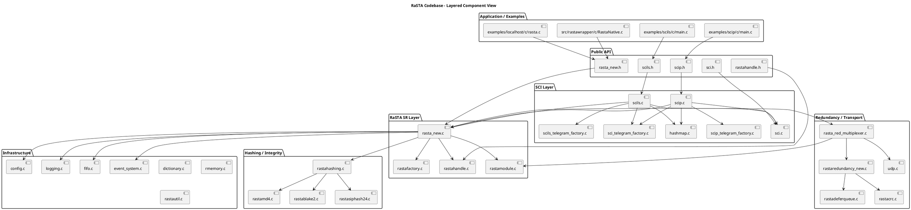

### Runtime Sequence View

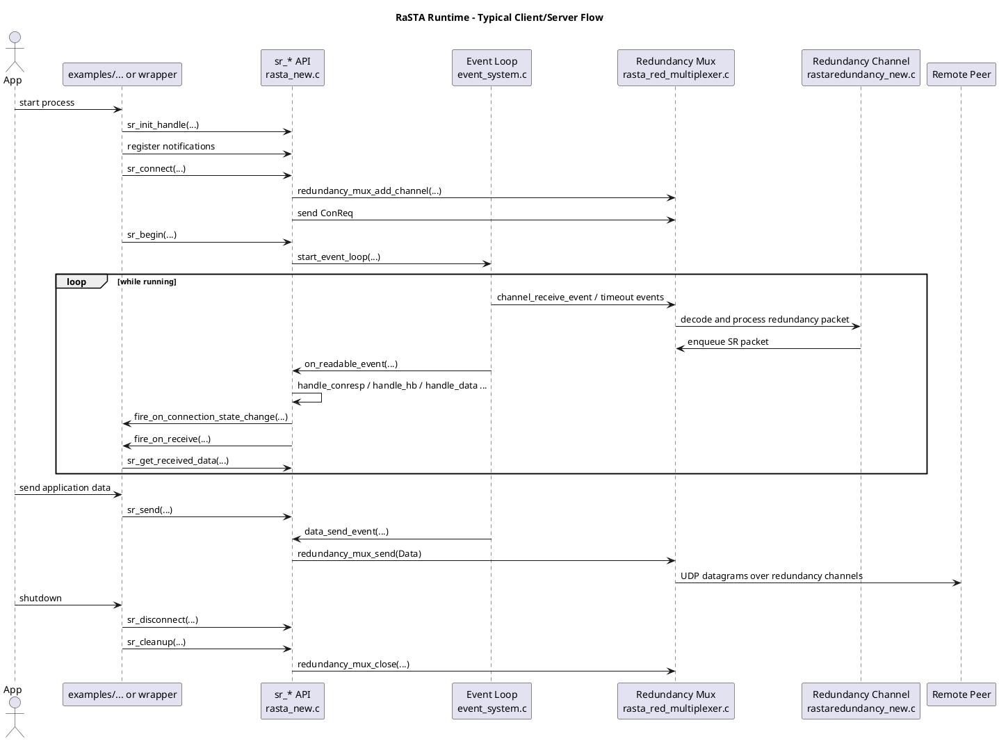

### Connection State Machine View

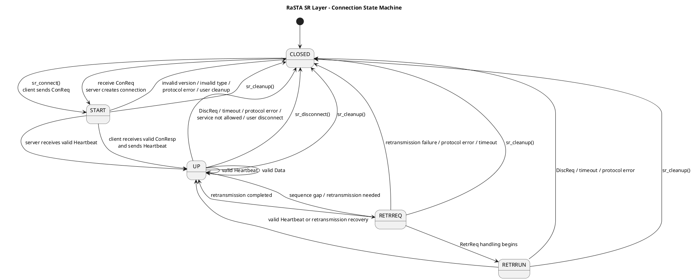

## Core RaSTA Files

### `src/rasta/c/config.c`

Role:
- Parses configuration files into the internal dictionary model.
- Applies defaults and converts configuration strings into typed runtime values.
- Resolves redundancy channel address information.

Important functions:
- `parser_init`: Initializes a line parser for a config line.
- `parser_next`: Advances parsing state one character at a time.
- `parser_skipBlanc`: Skips whitespace while parsing.
- `parser_parseIdentifier`: Reads a config key or symbolic token.
- `parser_parseNumber`: Parses decimal numbers.
- `parser_parseString`: Parses quoted strings.
- `parser_parseHex`: Parses `#`-prefixed hex values.
- `parser_parseArray`: Parses `{...}` style arrays used for accepted versions and
  redundancy channel lists.
- `parser_parseValue`: Dispatches value parsing and writes into the dictionary.
- `isWirelessNic`: Helper used when auto-selecting network interfaces.
- `getIpByNic`: Retrieves the IP address of a selected NIC.
- `extractIPData`: Converts a string such as `127.0.0.1:8888` into
  `struct RastaIPData`.
- `config_setstd`: Applies default values for missing config entries.
- `config_load`: Main entry point for reading a file and building
  `struct RastaConfig`.
- `config_get`: Dictionary-backed key lookup.
- `config_free`: Releases config dictionary memory.

Notes:
- This file combines lexical parsing, semantic conversion, and platform-specific
  NIC discovery in one module.
- Safety or certification work would likely split parsing from environment
  discovery.

### `src/rasta/c/dictionary.c`

Role:
- Implements a small dynamically-sized dictionary used by config parsing.

Important functions:
- `uppercase`: Normalizes keys for case-insensitive behavior.
- `dictionary_change_size`: Reallocates dictionary storage.
- `dictionary_add`: Inserts a generic entry.
- `allocate_DictionaryArray`: Allocates a string array container.
- `reallocate_DictionaryArray`: Resizes an array container.
- `free_DictionaryArray`: Releases array storage.
- `dictionary_create`: Creates an empty dictionary.
- `dictionary_free`: Frees all entries.
- `dictionary_isin`: Checks whether a key exists.
- `dictionary_addNumber`: Adds integer values.
- `dictionary_addString`: Adds string values.
- `dictionary_addArray`: Adds array values.
- `dictionary_get`: Retrieves an entry or an error entry.

### `src/rasta/c/event_system.c`

Role:
- Provides the internal event loop used by the newer RaSTA implementation.
- Supports timed events and FD readability events in one container.

Important functions:
- `get_nanotime`: Monotonic current time helper.
- `event_system_sleep`: Sleeps until timeout or FD readiness.
- `reschedule_event`: Resets a timed event relative to now.
- `calc_next_timed_event`: Finds the next due timed event.
- `start_event_loop`: Main blocking dispatcher.
- `enable_timed_event` / `disable_timed_event`: Toggle timed events.
- `enable_fd_event` / `disable_fd_event`: Toggle FD events.
- `init_event_container`: Initializes empty event storage.
- `linked_list_add` / `linked_list_remove`: Internal bookkeeping helpers.
- `add_fd_event` / `remove_fd_event`: Register and unregister FD events.
- `add_timed_event`: Register a timed event and initialize next deadline.
- `add_timed_event_no_time_init`: Register without recalculating next fire time.
- `remove_timed_event`: Unregister a timed event.

Notes:
- This file is infrastructure shared by the RaSTA receive/send/heartbeat flow
  and redundancy socket handling.

### `src/rasta/c/fifo.c`

Role:
- Implements a bounded FIFO queue abstraction used for application messages,
  send queues, retransmission queues, and redundancy receive buffers.

Important functions:
- `fifo_init`: Creates a queue with fixed capacity.
- `fifo_pop`: Removes the oldest entry.
- `fifo_push`: Adds a new element to the queue.
- `fifo_get_size`: Returns the current element count.
- `fifo_destroy`: Releases queue storage.

### `src/rasta/c/logging.c`

Role:
- Minimal logger abstraction for console/file logging with levels.

Important functions:
- `log_to_console`: Writes a formatted message to stdout/stderr path.
- `log_to_file`: Appends a message to a configured file.
- `get_log_message_string`: Builds the final log line.
- `logger_init`: Creates a logger with max level and sink type.
- `logger_set_log_file`: Sets file target for file logging.
- `logger_log`: Variadic logging API.
- `logger_log_if`: Conditional variadic logging API.
- `logger_destroy`: Closes file handles if needed.

### `src/rasta/c/rmemory.c`

Role:
- Thin wrappers around allocation and memory operations.

Important functions:
- `rmalloc`, `rrealloc`, `rfree`: Allocation wrappers.
- `rmemcpy`, `rmemset`: Memory operations.
- `rstrcpy`, `rstrcat`: String helpers.
- `rmemcmp`: Comparison helper.

Notes:
- The wrappers are light and currently do not enforce safety policies by
  themselves.

### `src/rasta/c/rastautil.c`

Role:
- Shared byte-array and endianness utilities.

Important functions:
- `current_ts`: Gets the current timestamp.
- `freeRastaByteArray`: Releases byte-array storage.
- `allocateRastaByteArray`: Allocates byte-array storage.
- `isBigEndian`: Detects platform endianness.
- `longToBytes`: Encodes a 32-bit integer.
- `bytesToLong`: Decodes a 32-bit integer.

### `src/rasta/c/udp.c`

Role:
- Wraps low-level UDP socket creation, bind, send, receive, and close behavior.

Important functions:
- `getSO_ERROR`: Reads socket error state.
- `udp_bind`: Binds a socket to any local address and port.
- `udp_bind_device`: Binds a socket to a specific IP and port.
- `udp_close`: Closes the socket.
- `udp_receive`: Receives one datagram.
- `udp_send`: Sends to `host:port`.
- `udp_send_sockaddr`: Sends using an already-built sockaddr.
- `udp_init`: Creates and configures a UDP socket.
- `sockaddr_to_host`: Converts sockaddr into a string IP.

### `src/rasta/c/rastacrc.c`

Role:
- Implements redundancy-layer CRC option presets and calculation.

Important functions:
- `reflect`: Bit reflection helper used by CRC logic.
- `crc_init_opt_a` to `crc_init_opt_e`: Build the five named CRC parameter sets.
- `crc_generate_table`: Precomputes the lookup table for selected options.
- `crc_calculate`: Calculates CRC over a `RastaByteArray`.

### `src/rasta/c/rastamd4.c`

Role:
- MD4 implementation used for SR-layer checksum support.

Important functions:
- `md4InitContext`: Builds a context from the configured IV values.
- `generateMD4`: Convenience entry point for MD4 hashing.
- `generateMD4WithVector`: Hashing with caller-provided initial vector/context.

### `src/rasta/c/rastablake2.c`

Role:
- BLAKE2 implementation used through the hashing abstraction.

Notes:
- The source is primarily third-party algorithm implementation; it does not
  expose locally-named public functions through the simple regex listing above.
- It is used indirectly via `rasta_calculate_hash` in `rastahashing.c`.

### `src/rasta/c/rastasiphash24.c`

Role:
- SipHash-2-4 implementation used through the hashing abstraction.

Important functions:
- `generateSiphash24`: Hashes a byte buffer using SipHash with the given key and
  output length variant.

### `src/rasta/c/rastahashing.c`

Role:
- Central hash abstraction that chooses MD4, BLAKE2, or SipHash depending on
  config.

Important functions:
- `rasta_md4_set_key`: Stores MD4 IV-style key material in context form.
- `rasta_get_md4_ctx_from_key`: Reconstructs an MD4 context from stored key data.
- `rasta_calculate_hash`: Dispatches to the selected hash implementation.

### `src/rasta/c/rastamodule.c`

Role:
- Serializes and deserializes RaSTA SR packets and redundancy packets.
- Owns the raw wire format conversion logic.

Important functions:
- `getRastamoduleLastError`: Returns and resets serializer error state.
- `shortToBytes` / `bytesToShort`: 16-bit conversions.
- `getDataLength`: Determines payload length from total packet length.
- `allocateBytes`: Allocates a byte buffer sized for packet serialization.
- `packFields`: Writes common packet header fields into the output buffer.
- `rastaModuleToBytes`: Encodes a RaSTA packet and computes SR checksum.
- `rastaModuleToBytesNoChecksum`: Encodes a packet using an already-provided
  checksum.
- `bytesToRastaPacket`: Parses a RaSTA packet from bytes.
- `rastaRedundancyPacketToBytes`: Encodes a redundancy-layer packet.
- `bytesToRastaRedundancyPacket`: Decodes a redundancy-layer packet.

Notes:
- This is one of the most important low-level files for certification or
  interoperability work because it defines the exact wire image.

### `src/rasta/c/rastafactory.c`

Role:
- Constructs and extracts typed packet payloads above the raw serializer.

Important functions:
- `allocateRastaMessageData`: Allocates an array of application messages.
- `freeRastaMessageData`: Frees message array contents.
- `getRastafactoryLastError`: Returns and clears factory error state.
- `extractRastaConnectionData`: Parses the payload of ConReq/ConResp.
- `extractRastaDisconnectionData`: Parses DiscReq payload.
- `extractMessageData`: Parses data and retransmitted-data payloads.
- `createRedundancyPacket`: Wraps an SR packet in a redundancy packet.

Public constructors declared in the header and implemented in this file:
- `createConnectionRequest`
- `createConnectionResponse`
- `createRetransmissionRequest`
- `createRetransmissionResponse`
- `createDisconnectionRequest`
- `createHeartbeat`
- `createDataMessage`
- `createRetransmittedDataMessage`

These constructors build fully-typed RaSTA PDUs before serialization.

### `src/rasta/c/rastalist.c`

Role:
- Dynamic list of active `rasta_connection` objects.

Important functions:
- `rastalist_change_size`: Resizes list backing storage.
- `rastalist_addConnection`: Appends a connection and returns its index.
- `rastalist_remove`: Deletes one connection by index.
- `rastalist_count`: Returns the number of used entries.
- `rastalist_getConnection`: Gets a connection by array index.
- `rastalist_getConnectionByRemote`: Looks up by remote RaSTA ID.
- `rastalist_getConnectionId`: Returns index by remote ID.
- `rastalist_create`: Creates an initial list.
- `rastalist_free`: Releases list memory.

### `src/rasta/c/rastadeferqueue.c`

Role:
- Stores out-of-order redundancy packets until missing sequence numbers arrive or
  timeout logic flushes them.

Important functions:
- `find_index`: Locates a sequence number inside the queue.
- `cmpfkt`: Comparison function for sorting by sequence number.
- `sort`: Keeps the defer queue ordered.
- `deferqueue_init`: Creates a defer queue with max size.
- `deferqueue_isfull`: Checks capacity.
- `deferqueue_add`: Adds a deferred redundancy packet.
- `deferqueue_remove`: Removes a deferred packet by sequence number.
- `deferqueue_contains`: Membership test.
- `deferqueue_destroy`: Frees defer queue memory.
- `deferqueue_smallest_seqnr`: Returns the smallest queued sequence number.
- `deferqueue_get`: Retrieves a deferred packet by sequence number.
- `deferqueue_get_ts`: Retrieves reception timestamp for a deferred packet.
- `deferqueue_clear`: Clears all stored deferred entries.

### `src/rasta/c/rastaredundancy_new.c`

Role:
- Implements the redundancy channel state logic around defer queues and delivery.

Important functions:
- `deliverDeferQueue`: Delivers now-unblocked deferred packets in order.
- `rasta_red_f_receive`: Main redundancy receive algorithm for one channel.
- `rasta_red_f_deferTmo`: Handles defer timeout expiration.
- `rasta_red_add_transport_channel`: Appends a UDP transport endpoint to a
  redundancy channel.
- `rasta_red_cleanup`: Releases redundancy channel resources.

### `src/rasta/c/rasta_red_multiplexer.c`

Role:
- Manages all UDP sockets and all redundancy channels to remote entities.
- Bridges raw socket events into redundancy packets and SR packets.

Important functions:
- `red_on_new_connection_caller`: Wrapper for firing new-channel notification.
- `red_call_on_new_connection`: Invokes the new-connection callback.
- `red_on_diagnostic_caller`: Wrapper for redundancy diagnostic callback.
- `receive_packet`: Reads from one UDP socket, decodes redundancy packet, and
  routes it to the proper channel.
- `channel_receive_event`: FD callback for readable UDP sockets.
- `channel_timeout_event`: Timed callback for redundancy timeout handling.
- `init_timeout_events`: Initializes the timeout event used by the mux.
- `redundancy_mux_init_`: Initializes using addresses from `config`.
- `redundancy_mux_init`: Initializes using raw listen port array.
- `redundancy_mux_init_with_devices`: Initializes using explicit IP/port array.
- `redundancy_mux_close`: Shuts down sockets and channels.
- `redundancy_mux_get_channel`: Returns channel by remote RaSTA ID.
- `redundancy_mux_set_config_id`: Assigns the remote ID of a config-backed
  channel.
- `redundancy_mux_send`: Encodes and sends an SR packet over redundancy paths.
- `redundancy_try_mux_retrieve`: Tries to dequeue one SR packet for a given
  entity.
- `redundancy_mux_wait_for_notifications`: Blocks until notification workers
  finish.
- `redundancy_mux_wait_for_entity`: Blocks until a channel for an entity exists.
- `redundancy_mux_add_channel`: Adds a new redundancy channel.
- `redundancy_mux_remove_channel`: Removes an existing redundancy channel.
- `get_queue_msg_count`: Returns pending SR packet count per redundancy channel.
- `redundancy_mux_try_retrieve_all`: Dequeues from any connected channel.

### `src/rasta/c/rastahandle.c`

Role:
- Owns the top-level `rasta_handle` structure.
- Wires callbacks, logger, config, hashing context, and sub-handles together.

Important functions:
- `sr_create_notification_result`: Builds the notification payload object.
- `on_constatechange_call`: Internal wrapper for connection-state callback.
- `fire_on_connection_state_change`: Fires `on_connection_state_change`.
- `on_receive_call`: Internal wrapper for receive callback.
- `fire_on_receive`: Fires `on_receive`.
- `on_discrequest_change_call`: Internal wrapper for DiscReq callback.
- `fire_on_discrequest_state_change`: Fires disconnection notification.
- `on_diagnostic_call`: Internal wrapper for diagnostic callback.
- `fire_on_diagnostic_notification`: Fires SR diagnostic notification.
- `on_handshake_complete_call`: Internal wrapper for handshake callback.
- `fire_on_handshake_complete`: Fires handshake completion notification.
- `on_heartbeat_timeout_call`: Internal wrapper for heartbeat timeout callback.
- `fire_on_heartbeat_timeout`: Fires timeout notification.
- `rasta_handle_manually_init`: Initializes a handle from explicit config data.
- `rasta_handle_init`: Initializes from a config file.

Notes:
- Despite comments referring to separate threads, the current callback firing
  paths are largely synchronous wrappers.

### `src/rasta/c/rasta_new.c`

Role:
- Main implementation of the current RaSTA protocol engine.
- Contains connection state machine, packet validation, retransmission handling,
  heartbeat logic, public API, and event loop integration.

Function groups:

General helpers:
- `cur_timestamp`: Monotonic timestamp in milliseconds.
- `long_random`: Pseudo-random initial sequence source.
- `get_initial_seq_num`: Reads initial sequence number from config or random.
- `compare_version`: Compares two version strings.
- `version_accepted`: Checks whether a remote version is accepted.

Packet send helpers:
- `send_DisconnectionRequest`
- `send_Heartbeat`
- `send_RetransmissionRequest`
- `send_RetransmissionResponse`

Queue and diagnostic helpers:
- `sr_retr_data_available`: Returns retransmission queue size.
- `sr_rasta_send_data_available`: Returns application send queue size.
- `updateTI`: Recomputes T_i timeout window.
- `resetDiagnostic`: Clears accumulated diagnostic counters.
- `updateDiagnostic`: Updates diagnostic counters and fires notification when the
  window fills.
- `longToBytes2` / `bytesToLong2`: Additional integer conversion helpers.
- `sr_add_app_messages_to_buffer`: Moves delivered app messages into the
  connection receive FIFO and fires `on_receive`.
- `sr_remove_confirmed_messages`: Drops retransmission-buffer entries confirmed
  by the peer.

Packet validation helpers:
- `sr_cts_in_seq`: Validates confirmed timestamp sequence rules.
- `sr_sn_in_seq`: Validates incoming sequence number.
- `sr_sn_range_valid`: Validates sequence window.
- `sr_cs_valid`: Validates confirmed sequence number.
- `sr_message_authentic`: Checks sender/receiver IDs.
- `sr_check_packet`: Common validation entry used by several packet handlers.

Connection lifecycle helpers:
- `sr_reset_connection`: Resets a connection object to initial values.
- `sr_close_connection`: Sends a DiscReq if needed, updates state, removes
  timers, and fires notifications.
- `sr_diagnostic_interval_init`: Initializes diagnostic interval buckets.
- `sr_init_connection`: Allocates queue/timer fields of one connection.
- `sr_retransmit_data`: Sends retransmitted data from `fifo_retr`.

Incoming packet handlers:
- `handle_conreq`: Server-side handling of a received connection request.
- `handle_conresp`: Client-side handling of a connection response.
- `handle_discreq`: Handling for disconnection request.
- `handle_hb`: Handles heartbeat during setup and steady-state.
- `handle_data`: Validates data packets, delivers payload, or requests
  retransmission.
- `handle_retrreq`: Handles retransmission request.
- `handle_retrresp`: Handles retransmission response.
- `handle_retrdata`: Handles retransmitted data packets.

Event setup and event callbacks:
- `init_conn_expired_event`: Initializes T_i expiration callback.
- `init_heartbeat_send_event`: Initializes periodic heartbeat callback.
- `init_and_start_connection_events`: Starts heartbeat and timeout timers for one
  connection.
- `on_readable_event`: Poll-style receive callback that drains redundancy
  queues and dispatches packet handlers.
- `event_connection_expired`: Handles heartbeat timeout expiration.
- `heartbeat_send_event`: Periodically transmits heartbeat if needed.
- `data_send_event`: Drains the application send queue and creates data PDUs.
- `init_io_events`: Registers internal send and receive timed events.

Public API:
- `sr_init_handle_manually`: Manual initialization entry point.
- `sr_init_handle`: Config-file initialization entry point.
- `sr_connect`: Client-side connection establishment.
- `sr_send`: Queues application data for transmission.
- `sr_get_received_data`: Pops one application message from receive buffer.
- `sr_disconnect`: User-requested disconnect.
- `sr_cleanup`: Releases queues, config, mux, and handle storage.
- `sr_begin`: Starts the event-driven protocol runtime.

Notes:
- This file is the core of the current implementation.
- If one needs to understand the protocol behavior, this is the first source
  file to read after the public headers.

## SCI Files

### `src/sci/c/hashmap.c`

Role:
- Simple string-keyed hashmap used to map SCI names to RaSTA IDs.

Important functions:
- `hashmap_new`: Creates a hashmap.
- `hashmap_hash_int`: Low-level hash computation.
- `hashmap_hash`: Hash wrapper.
- `hashmap_rehash`: Grows and rehashes the table.
- `hashmap_put`: Inserts a key/value pair.
- `hashmap_get`: Looks up a key.
- `hashmap_iterate`: Iterates all entries.
- `hashmap_remove`: Removes one key.
- `hashmap_free`: Frees the map.
- `hashmap_length`: Returns element count.

### `src/sci/c/sci.c`

Role:
- Common SCI telegram encoding and decoding utilities.

Important functions:
- `sci_set_sender`: Writes padded sender name.
- `sci_set_receiver`: Writes padded receiver name.
- `sci_get_name_string`: Converts padded fixed-length name to heap string.
- `sci_set_message_type`: Writes message type with required byte order.
- `sci_encode_telegram`: Converts `sci_telegram` into `RastaByteArray`.
- `sci_decode_telegram`: Parses a byte array into `sci_telegram`.
- `sci_get_message_type`: Reads a telegram message type.

### `src/sci/c/sci_telegram_factory.c`

Role:
- Common SCI telegram constructors for version/status telegram types.

Important functions:
- `sci_create_base_telegram`: Builds the common telegram skeleton.
- `sci_create_version_request`: Builds a version request.
- `sci_create_status_request`: Builds a status request.
- `sci_create_status_begin`: Builds a status begin telegram.
- `sci_create_status_finish`: Builds a status finish telegram.
- `sci_parse_version_request_payload`: Decodes version-request payload.

Implemented but not listed by the simple regex because of multiline signature:
- `sci_create_version_response`
- `sci_parse_version_response_payload`

### `src/sci/c/scip_telegram_factory.c`

Role:
- SCI-P specific telegram constructors and payload parsers.

Important functions:
- `scip_create_change_location_telegram`
- `scip_create_location_status_telegram`
- `scip_create_timeout_telegram`
- `scip_parse_change_location_payload`
- `scip_parse_location_status_payload`

### `src/sci/c/scils_telegram_factory.c`

Role:
- SCI-LS specific telegram constructors and payload parsers.

Important functions:
- `scils_signal_aspect_defaults`: Returns a default signal aspect structure.
- `scils_create_show_signal_aspect`
- `scils_create_change_brightness`
- `scils_create_signal_aspect_status`
- `scils_create_brightness_status`
- `scils_parse_show_signal_aspect_payload`
- `scils_parse_signal_aspect_status_payload`
- `scils_parse_change_brightness_payload`
- `scils_parse_brightness_status_payload`

### `src/sci/c/scip.c`

Role:
- SCI-P session wrapper on top of RaSTA.

Important functions:
- `send_telegram`: Internal SCI-P send helper that resolves receiver name to
  RaSTA ID and uses `sr_send`.
- `scip_init`: Allocates and initializes a SCI-P instance.
- `scip_cleanup`: Releases SCI-P resources.
- `scip_send_version_request`
- `scip_send_status_request`
- `scip_send_status_begin`
- `scip_send_status_finish`
- `scip_send_change_location`
- `scip_send_location_status`
- `scip_send_timeout`
- `handle_version_request`: Parses and dispatches version request callbacks.
- `handle_version_response`: Parses and dispatches version response callbacks.
- `handle_change_location`: Parses and dispatches point target location.
- `handle_location_status`: Parses and dispatches point current location.
- `scip_on_rasta_receive`: Main demultiplexer from RaSTA app message to SCI-P
  callbacks.
- `scip_register_sci_name`: Registers SCI-name to RaSTA-ID mapping.

### `src/sci/c/scils.c`

Role:
- SCI-LS session wrapper on top of RaSTA.

Important functions:
- `scils_send_telegram`: Internal SCI-LS send helper.
- `scils_init`: Allocates and initializes a SCI-LS instance.
- `scils_cleanup`: Releases SCI-LS resources.
- `scils_send_version_request`
- `scils_send_status_request`
- `scils_send_status_begin`
- `scils_send_status_finish`
- `scils_send_show_signal_aspect`
- `scils_send_signal_aspect_status`
- `scils_send_change_brightness`
- `scils_send_brightness_status`
- `scils_handle_version_request`: Dispatches version request callback.
- `scils_handle_version_response`: Dispatches version response callback.
- `handle_show_signal_aspect`
- `handle_signal_aspect_status`
- `handle_change_brightness`
- `handle_brightness_status`
- `scils_on_rasta_receive`: Main demultiplexer from RaSTA app message to SCI-LS
  callbacks.
- `scils_register_sci_name`: Registers SCI-name to RaSTA-ID mapping.

## Wrapper File

### `src/rastawrapper/c/RastaNative.c`

Role:
- Native callback bridge likely intended for Java or wrapper integration.

Important functions:
- `onReceive`: Receive callback hook.
- `onDisconnection`: Disconnection callback hook.
- `onTimeout`: Heartbeat timeout callback hook.
- `onNewConnection`: New connection callback hook.

## Example Programs

### Shared purpose of examples

The example programs serve two roles:

1. Show API usage patterns.
2. Provide quick manual interoperability checks.

### `examples/localhost/c/rasta.c`

Role:
- Event-loop based localhost RaSTA demo.

Important functions:
- `printHelpAndExit`: CLI argument help.
- `addRastaString`: Builds one application message string.
- `onConnectionStateChange`: Reacts to connection state updates.
- `onHandshakeCompleted`: Prints handshake completion.
- `onTimeout`: Prints heartbeat timeout.
- `onReceive`: Reads application data and forwards it in the demo scenario.
- `connect_on_stdin`: FD callback to start a client connection.
- `terminator`: FD callback to cleanup and stop.
- `main`: Initializes handles, registers callbacks, and starts `sr_begin`.

Sequence diagram:

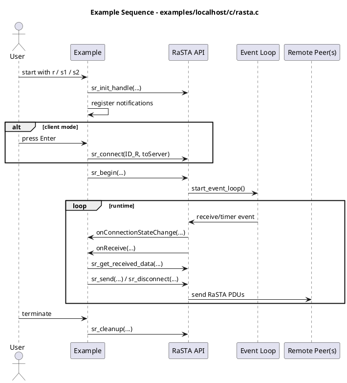

### `examples/rasta/c/main.c`

Role:
- Older remote/networked RaSTA demo that shows the same forwarding scenario.

Important functions:
- `printHelpAndExit`
- `addRastaString`
- `onConnectionStateChange`
- `onHandshakeCompleted`
- `onTimeout`
- `onReceive`
- `main`

Notes:
- This example uses blocking `getchar` flow rather than the newer FD-event
  integration style.

Sequence diagram:

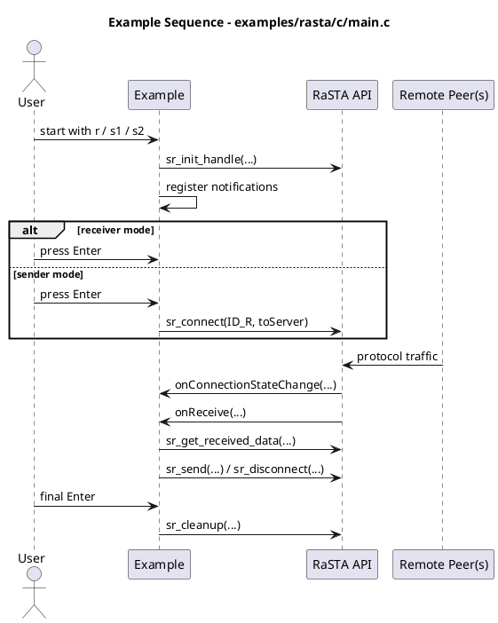

### `examples/localhost/c/scip.c` and `examples/scip/c/main.c`

Role:
- Demonstrate SCI-P on top of RaSTA.

Important functions:
- `printHelpAndExit`
- `onReceive`: Converts RaSTA receive callbacks into SCI-P receive handling.
- `onHandshakeComplete`: Registers remote SCI names and sends example telegrams.
- `onChangeLocation`: Handles incoming point target location command.
- `onLocationStatus`: Handles incoming point status.
- `main`: Initializes RaSTA and SCI-P objects and drives the example.

Sequence diagrams:

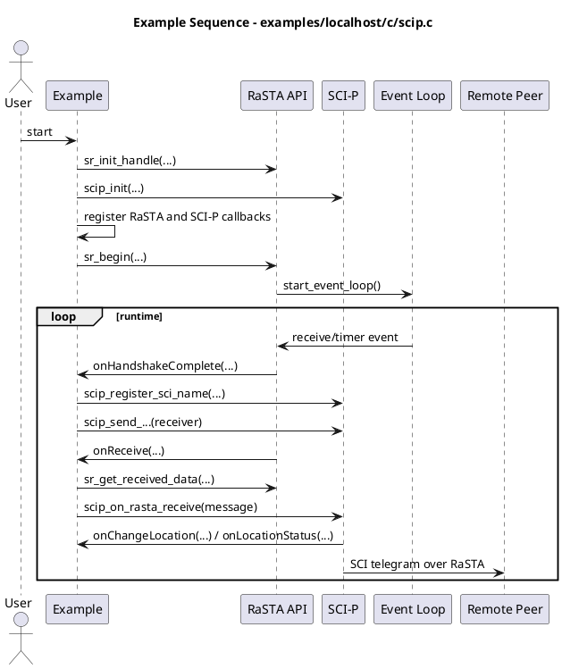

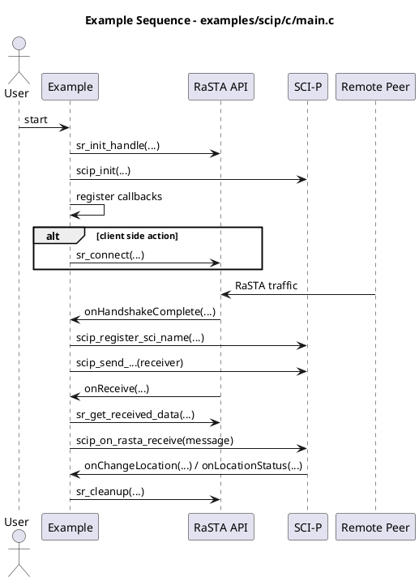

### `examples/localhost/c/scils.c` and `examples/scils/c/main.c`

Role:
- Demonstrate SCI-LS on top of RaSTA.

Important functions:
- `printHelpAndExit`
- `onReceive`
- `onHandshakeComplete`
- `onShowSignalAspect`
- `onSignalAspectStatus`
- `main`

Sequence diagrams:

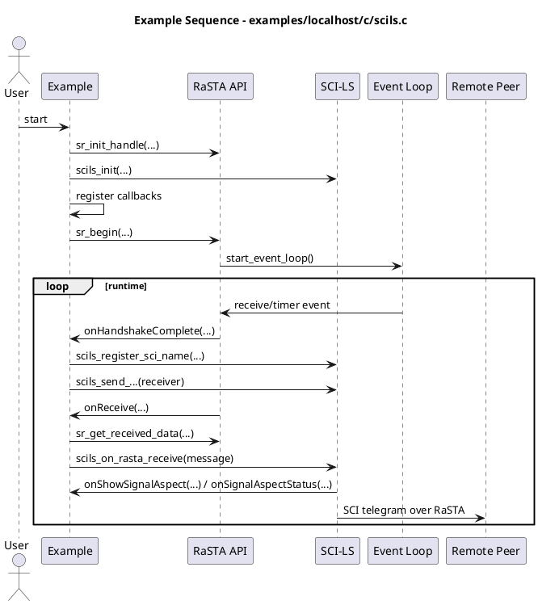

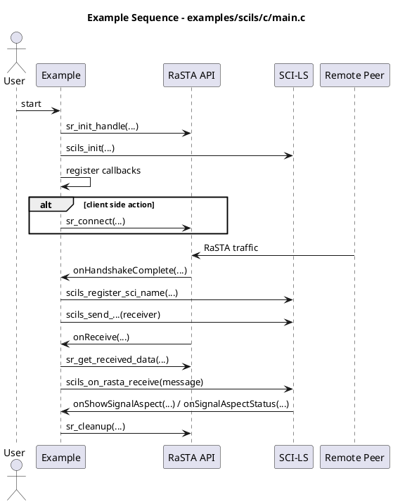

### `examples/localhost/c/event_test.c`

Role:
- Small standalone event system demonstration.

Important functions:
- `test_get_nanotime`
- `send_heartbeat_event`
- `disconnect_event`
- `event_read`
- `main`

Sequence diagram:

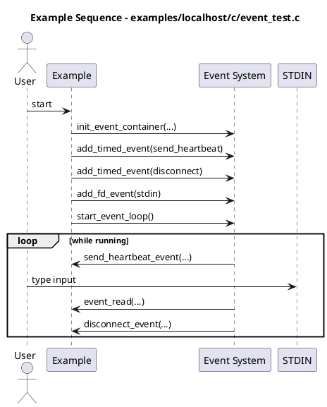

### `examples/redundancy_test/c/main.c`

Role:
- Manual redundancy-layer forwarding test without full RaSTA SR layer.

Important functions:
- `on_new_connection`: Handles discovery of a new redundancy channel.
- `main`: Builds and runs the manual redundancy example.

Sequence diagram:

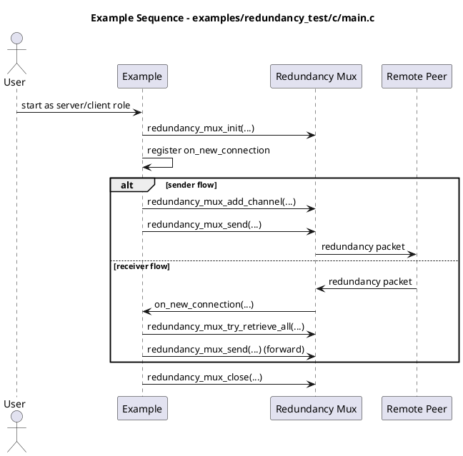

### `examples/mux_stresstest/c/main.c`

Role:
- Stress-style program for exercising the redundancy multiplexer.

Important functions:
- `on_new_connection`
- `main`

Sequence diagram:

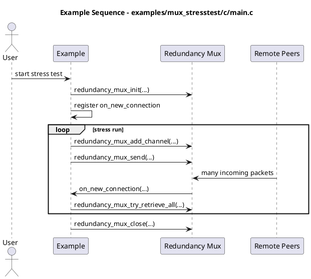

### `examples/logging/c/main.c`

Role:
- Minimal logger usage example.

Important functions:
- `main`

Sequence diagram:

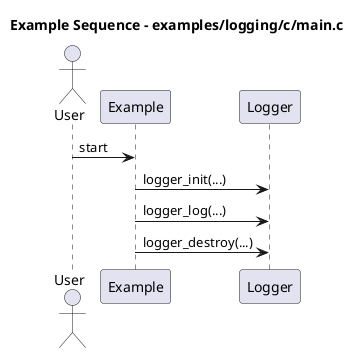

### `examples/tests_manual/c/raw_udp_test.c`

Role:
- Manual raw UDP helper for socket-level checking.

Important functions:
- `printHelpAndExit`
- `main`

Sequence diagram:

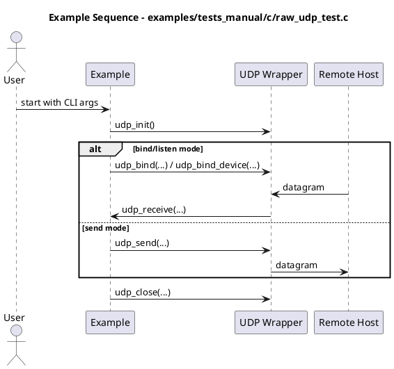

### `examples/wrapperTestClient/c/main.c`

Role:
- Example client intended for wrapper/native integration testing.

Important functions:
- `addRastaString`
- `onConnectionStateChange`
- `onReceive`
- `main`

Sequence diagram:

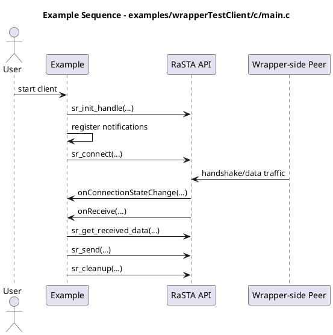

## Test Files

### Test organization

The `tests` directory contains CUnit suites for low-level modules. Coverage is
good for data structures and serialization, thinner for end-to-end protocol
behavior.

### `tests/rasta/c/registerTests.c`

Role:
- Registers all RaSTA CUnit test suites and runs them.

Important functions:
- `suite_init`
- `suite_clean`
- `cunit_register`
- `main`

### `tests/sci/c/registerTests.c`

Role:
- Registers all SCI CUnit test suites and runs them.

Important functions:
- `suite_init`
- `suite_clean`
- `cunit_register`
- `main`

### RaSTA unit tests

- `tests/rasta/c/configtest.c`
  - `check_std_config`: Verifies default config behavior.
  - `check_var_config`: Verifies overridden config values.
- `tests/rasta/c/dictionarytest.c`
  - `testDictionary`: Exercises dictionary insertion and lookup.
- `tests/rasta/c/fifotest.c`
  - `test_push`, `test_pop`: FIFO behavior checks.
- `tests/rasta/c/rastacrcTest.c`
  - `test_opt_b`, `test_opt_c`, `test_opt_d`, `test_opt_e`,
    `test_without_gen_table`: CRC option checks.
- `tests/rasta/c/rastadeferqueueTest.c`
  - `test_deferqueue_init`, `test_deferqueue_destroy`, `test_deferqueue_add`,
    `test_deferqueue_remove`, `test_deferqueue_add_full`,
    `test_deferqueue_remove_not_in_queue`, `test_deferqueue_contains`,
    `test_deferqueue_isfull`, `test_deferqueue_smallestseqnr`,
    `test_deferqueue_get`, `test_deferqueue_sorted`, `test_deferqueue_clear`,
    `test_deferqueue_get_ts`, `test_deferqueue_get_ts_doesnt_contain`
- `tests/rasta/c/rastafactoryTest.c`
  - `checkConnectionPacket`, `checkNormalPacket`,
    `checkDisconnectionRequest`, `checkMessagePacket`,
    `testCreateRedundancyPacket`, `testCreateRedundancyPacketNoChecksum`
- `tests/rasta/c/rastalisttest.c`
  - `check_rastalist`
- `tests/rasta/c/rastamd4Test.c`
  - `testMD4function`, `testRastaMD4Sample`
- `tests/rasta/c/rastamoduleTest.c`
  - `testConversion`,
    `testRedundancyConversionWithCrcChecksumCorrect`,
    `testRedundancyConversionWithoutChecksum`,
    `testRedundancyConversionIncorrectChecksum`
- `tests/rasta/c/blake2test.c`
  - `testBlake2Hash`, `selftest_seq`, `blake2b_selftest`
- `tests/rasta/c/siphash24test.c`
  - `testSipHash24`

### SCI unit tests

- `tests/sci/c/sciTests.c`
  - `testEncode`, `testDecode`, `testDecodeInvalid`, `testSetSender`,
    `testSetReceiver`, `testGetName`, `testSetMessageType`,
    `testCreateVersionRequest`, `testCreateVersionResponse`,
    `testCreateStatusRequest`, `testCreateStatusBegin`,
    `testCreateStatusFinish`, `testGetMessageType`,
    `testParseVersionRequest`, `testParseVersionResponse`
- `tests/sci/c/scilsTests.c`
  - `testSignalAspectDefaults`, `testCreateShowSignalAspect`,
    `testCreateSignalAspectStatus`, `testCreateChangeBrightness`,
    `testCreateBrightnessStatus`, `testParseShowSignalAspect`,
    `testParseSignalAspectStatus`, `testParseChangeBrightness`,
    `testParseBrightnessStatus`
- `tests/sci/c/scipTests.c`
  - `testCreateChangeLocation`, `testCreateLocationStatus`,
    `testCreateTimeout`, `testParseChangeLocation`,
    `testParseLocationStatus`

## Public Headers Worth Reading First

If someone wants to understand the API surface before reading implementation,
the most useful headers are:

- `src/rasta/headers/rasta_new.h`: Main public RaSTA API.
- `src/rasta/headers/rastahandle.h`: Handle shape and notification callbacks.
- `src/rasta/headers/rastafactory.h`: Packet payload model and constructors.
- `src/rasta/headers/rasta_red_multiplexer.h`: Redundancy mux API and data
  model.
- `src/sci/headers/sci.h`: SCI telegram model.
- `src/sci/headers/scip.h`: SCI-P API.
- `src/sci/headers/scils.h`: SCI-LS API.

## Suggested Reading Order

For a new engineer, the fastest reading order is:

1. `src/rasta/headers/rasta_new.h`
2. `src/rasta/headers/rastahandle.h`
3. `src/rasta/c/rasta_new.c`
4. `src/rasta/c/rasta_red_multiplexer.c`
5. `src/rasta/c/rastamodule.c`
6. `src/rasta/c/rastafactory.c`
7. `src/rasta/c/config.c`
8. `src/sci/c/sci.c`
9. `src/sci/c/scip.c` and `src/sci/c/scils.c`
10. `examples/localhost/c/rasta.c`

## Known Reading Caveats

- Some comments still describe thread-based behavior even though the newer
  runtime is mostly event-loop driven.
- The example set mixes older blocking style examples and newer `sr_begin`
  event-driven examples.
- Low-level crypto files contain imported algorithm code that is less useful for
  high-level protocol understanding.
- Several modules mix responsibilities that would likely be split in a fresh
  implementation.
