# RaSTA 코드베이스 상세 분석

## 목적

이 문서는 현재 코드베이스를 파일 단위와 함수 단위로 설명합니다.
기준 시점은 2026년 3월 13일의 저장소 상태이며, 코드 읽기, 온보딩,
향후 재구현 계획 수립을 돕기 위한 자료입니다.

## 저장소 구조

- `src/rasta`: RaSTA 코어 스택, 전송/중복화 로직, 패킷 인코딩,
  설정 파싱, 로깅, 큐/이벤트 인프라를 포함합니다.
- `src/sci`: SCI 공통 계층과, RaSTA application message 위에서 동작하는
  SCI-P / SCI-LS 프로토콜 어댑터를 포함합니다.
- `src/rastawrapper`: 외부 연동을 위한 네이티브 래퍼 콜백을 포함합니다.
- `examples`: localhost, 네트워크 예제, redundancy 테스트, 로깅,
  wrapper 사용 예제를 포함한 독립 실행 프로그램 모음입니다.
- `tests`: RaSTA와 SCI 모듈에 대한 CUnit 기반 단위 테스트입니다.
- `config`: 예제 및 데모용 설정 파일입니다.
- `md_doc`: 기존 프로젝트 문서와 이 분석 문서를 포함합니다.

## 상위 수준 런타임 모델

코드는 계층형 전송 모델로 구성되어 있습니다.

1. UDP 소켓은 redundancy multiplexer가 관리합니다.
2. redundancy 계층은 시퀀스 정렬과 채널 진단을 담당합니다.
3. RaSTA SR 계층은 연결 관리, 핸드셰이크, 시퀀싱, heartbeat,
   retransmission, application message 전달을 담당합니다.
4. SCI-P와 SCI-LS는 RaSTA 위에서 application telegram을 구성합니다.

현재 구현은 주로 이벤트 루프 기반입니다. 공개 라이프사이클은 다음과 같습니다.

1. `sr_init_handle` 또는 `sr_init_handle_manually`로 핸들을 초기화합니다.
2. `handle.notifications`에 콜백을 등록합니다.
3. 클라이언트 역할이면 `sr_connect`로 연결을 생성합니다.
4. `sr_begin`으로 처리를 시작합니다.
5. 송신은 `sr_send`, 수신은 `on_receive` + `sr_get_received_data`로 처리합니다.
6. 종료 시 `sr_disconnect`를 호출하고, 반드시 `sr_cleanup`으로 정리합니다.

## UML 개요

아래 PlantUML 다이어그램은 파일별 상세 설명에 들어가기 전에 전체 구조와
주요 실행 흐름을 빠르게 파악하기 위한 요약입니다.

### 계층별 컴포넌트 뷰

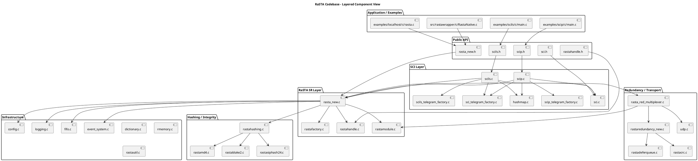

### 런타임 시퀀스 뷰

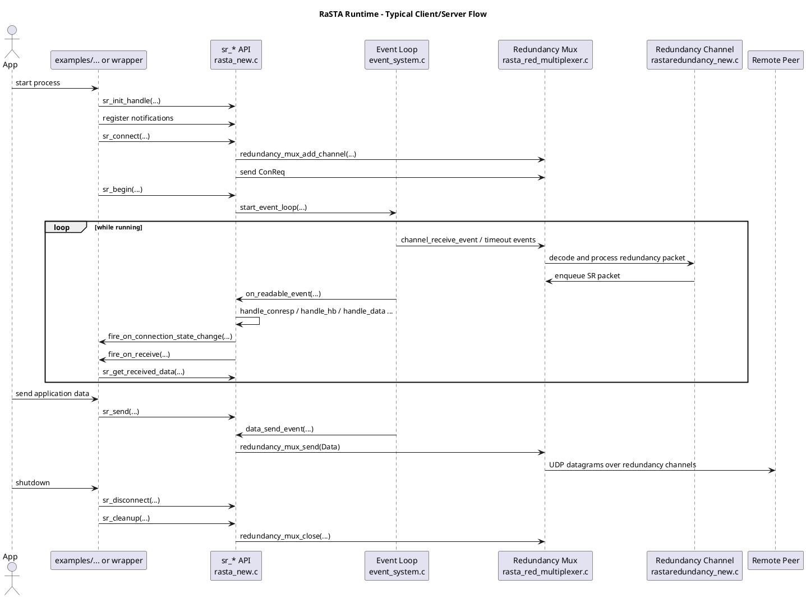

### 연결 상태 머신 뷰

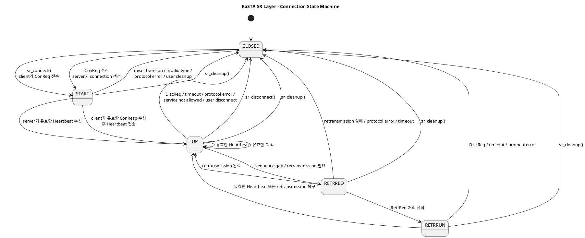

## 핵심 RaSTA 파일

### `src/rasta/c/config.c`

역할:
- 설정 파일을 내부 dictionary 모델로 파싱합니다.
- 기본값을 적용하고, 설정 문자열을 런타임에서 쓰는 타입으로 변환합니다.
- redundancy 채널 주소 정보를 해석합니다.

주요 함수:
- `parser_init`: 설정 파일 한 줄에 대한 파서를 초기화합니다.
- `parser_next`: 파싱 상태를 문자 단위로 한 칸 진행합니다.
- `parser_skipBlanc`: 파싱 중 공백을 건너뜁니다.
- `parser_parseIdentifier`: 설정 키 또는 심볼 토큰을 읽습니다.
- `parser_parseNumber`: 10진수 숫자를 파싱합니다.
- `parser_parseString`: 따옴표로 감싼 문자열을 파싱합니다.
- `parser_parseHex`: `#` 접두어가 붙은 16진수를 파싱합니다.
- `parser_parseArray`: accepted version이나 redundancy channel 목록에
  사용되는 `{...}` 형식 배열을 파싱합니다.
- `parser_parseValue`: 값 파싱을 분기 처리하고 dictionary에 기록합니다.
- `isWirelessNic`: 네트워크 인터페이스 자동 선택 시 쓰는 보조 함수입니다.
- `getIpByNic`: 선택된 NIC의 IP 주소를 가져옵니다.
- `extractIPData`: `127.0.0.1:8888` 같은 문자열을
  `struct RastaIPData`로 변환합니다.
- `config_setstd`: 누락된 설정 항목에 기본값을 적용합니다.
- `config_load`: 파일을 읽고 `struct RastaConfig`를 만드는 메인 진입점입니다.
- `config_get`: dictionary 기반 키 조회입니다.
- `config_free`: 설정 dictionary 메모리를 해제합니다.

비고:
- 이 파일은 lexical parsing, semantic conversion, 플랫폼 의존 NIC 탐색을
  하나의 모듈에 같이 넣고 있습니다.
- 안전 또는 인증 관점에서는 파싱과 환경 탐색을 분리하는 편이 더 적절합니다.

### `src/rasta/c/dictionary.c`

역할:
- 설정 파싱에 사용되는 작은 동적 dictionary를 구현합니다.

주요 함수:
- `uppercase`: 키를 대소문자 비의존적으로 처리하기 위해 정규화합니다.
- `dictionary_change_size`: dictionary 저장공간을 재할당합니다.
- `dictionary_add`: 일반 entry를 삽입합니다.
- `allocate_DictionaryArray`: 문자열 배열 컨테이너를 할당합니다.
- `reallocate_DictionaryArray`: 배열 컨테이너 크기를 변경합니다.
- `free_DictionaryArray`: 배열 저장공간을 해제합니다.
- `dictionary_create`: 빈 dictionary를 생성합니다.
- `dictionary_free`: 모든 entry를 해제합니다.
- `dictionary_isin`: 키 존재 여부를 확인합니다.
- `dictionary_addNumber`: 정수 값을 추가합니다.
- `dictionary_addString`: 문자열 값을 추가합니다.
- `dictionary_addArray`: 배열 값을 추가합니다.
- `dictionary_get`: entry를 조회하거나 에러 entry를 반환합니다.

### `src/rasta/c/event_system.c`

역할:
- 새로운 RaSTA 구현에서 사용하는 내부 이벤트 루프를 제공합니다.
- timed event와 FD readability event를 하나의 컨테이너로 처리합니다.

주요 함수:
- `get_nanotime`: monotonic 현재 시각 helper입니다.
- `event_system_sleep`: timeout 또는 FD readiness까지 대기합니다.
- `reschedule_event`: timed event를 현재 시각 기준으로 재설정합니다.
- `calc_next_timed_event`: 다음으로 실행될 timed event를 찾습니다.
- `start_event_loop`: 메인 블로킹 디스패처입니다.
- `enable_timed_event` / `disable_timed_event`: timed event를 켜고 끕니다.
- `enable_fd_event` / `disable_fd_event`: FD event를 켜고 끕니다.
- `init_event_container`: 빈 이벤트 저장소를 초기화합니다.
- `linked_list_add` / `linked_list_remove`: 내부 bookkeeping helper입니다.
- `add_fd_event` / `remove_fd_event`: FD event를 등록/해제합니다.
- `add_timed_event`: timed event를 등록하고 다음 실행 시각을 초기화합니다.
- `add_timed_event_no_time_init`: 다음 실행 시각 계산 없이 등록합니다.
- `remove_timed_event`: timed event를 해제합니다.

비고:
- 이 파일은 RaSTA receive/send/heartbeat 흐름과 redundancy 소켓 처리에서
  공통 인프라로 사용됩니다.

### `src/rasta/c/fifo.c`

역할:
- application message, send queue, retransmission queue, redundancy receive
  buffer에 사용되는 bounded FIFO 큐를 구현합니다.

주요 함수:
- `fifo_init`: 고정 용량 큐를 생성합니다.
- `fifo_pop`: 가장 오래된 항목을 제거합니다.
- `fifo_push`: 새 항목을 추가합니다.
- `fifo_get_size`: 현재 요소 수를 반환합니다.
- `fifo_destroy`: 큐 저장공간을 해제합니다.

### `src/rasta/c/logging.c`

역할:
- 콘솔/파일 로깅과 log level을 지원하는 최소 logger 추상화입니다.

주요 함수:
- `log_to_console`: 포맷된 메시지를 콘솔로 출력합니다.
- `log_to_file`: 메시지를 설정된 파일에 append합니다.
- `get_log_message_string`: 최종 로그 문자열을 만듭니다.
- `logger_init`: 최대 레벨과 sink type으로 logger를 생성합니다.
- `logger_set_log_file`: 파일 로깅 대상 파일을 설정합니다.
- `logger_log`: variadic logging API입니다.
- `logger_log_if`: 조건부 variadic logging API입니다.
- `logger_destroy`: 필요 시 파일 핸들을 닫습니다.

### `src/rasta/c/rmemory.c`

역할:
- 메모리 할당과 메모리 연산을 감싼 얇은 wrapper입니다.

주요 함수:
- `rmalloc`, `rrealloc`, `rfree`: 메모리 할당 wrapper입니다.
- `rmemcpy`, `rmemset`: 메모리 연산 함수입니다.
- `rstrcpy`, `rstrcat`: 문자열 helper입니다.
- `rmemcmp`: 비교 helper입니다.

비고:
- 이 wrapper 자체가 안전 정책을 강제하지는 않습니다.

### `src/rasta/c/rastautil.c`

역할:
- 공통 byte-array 및 endianness 유틸리티를 제공합니다.

주요 함수:
- `current_ts`: 현재 timestamp를 가져옵니다.
- `freeRastaByteArray`: byte-array 저장공간을 해제합니다.
- `allocateRastaByteArray`: byte-array 저장공간을 할당합니다.
- `isBigEndian`: 플랫폼 endianness를 판별합니다.
- `longToBytes`: 32-bit 정수를 인코딩합니다.
- `bytesToLong`: 32-bit 정수를 디코딩합니다.

### `src/rasta/c/udp.c`

역할:
- 저수준 UDP 소켓 생성, bind, send, receive, close 동작을 감쌉니다.

주요 함수:
- `getSO_ERROR`: 소켓 에러 상태를 읽습니다.
- `udp_bind`: 임의의 로컬 주소와 포트에 소켓을 bind합니다.
- `udp_bind_device`: 특정 IP와 포트에 소켓을 bind합니다.
- `udp_close`: 소켓을 닫습니다.
- `udp_receive`: datagram 하나를 수신합니다.
- `udp_send`: `host:port`로 전송합니다.
- `udp_send_sockaddr`: 이미 구성된 sockaddr로 전송합니다.
- `udp_init`: UDP 소켓을 생성하고 초기 설정합니다.
- `sockaddr_to_host`: sockaddr를 문자열 IP로 변환합니다.

### `src/rasta/c/rastacrc.c`

역할:
- redundancy 계층 CRC 옵션 preset과 CRC 계산을 구현합니다.

주요 함수:
- `reflect`: CRC 로직에서 쓰이는 비트 reflection helper입니다.
- `crc_init_opt_a` ~ `crc_init_opt_e`: 5개의 named CRC 파라미터 세트를 만듭니다.
- `crc_generate_table`: 선택된 옵션에 대한 lookup table을 생성합니다.
- `crc_calculate`: `RastaByteArray`에 대한 CRC를 계산합니다.

### `src/rasta/c/rastamd4.c`

역할:
- SR 계층 checksum 지원에 사용되는 MD4 구현입니다.

주요 함수:
- `md4InitContext`: 설정된 IV 값으로 context를 만듭니다.
- `generateMD4`: MD4 해싱 편의 함수입니다.
- `generateMD4WithVector`: caller가 준 initial vector/context로 해싱합니다.

### `src/rasta/c/rastablake2.c`

역할:
- hashing abstraction을 통해 사용되는 BLAKE2 구현입니다.

비고:
- 이 소스는 주로 서드파티 알고리즘 구현으로 보이며, 간단한 regex 목록에서는
  로컬 공개 함수명이 직접 드러나지 않습니다.
- 실제 사용은 `rastahashing.c`의 `rasta_calculate_hash`를 통해 간접적으로 이뤄집니다.

### `src/rasta/c/rastasiphash24.c`

역할:
- hashing abstraction을 통해 사용되는 SipHash-2-4 구현입니다.

주요 함수:
- `generateSiphash24`: 주어진 키와 출력 길이 변형에 따라 byte buffer를 해싱합니다.

### `src/rasta/c/rastahashing.c`

역할:
- config에 따라 MD4, BLAKE2, SipHash를 선택하는 중앙 hash abstraction입니다.

주요 함수:
- `rasta_md4_set_key`: MD4 IV 형태의 key material을 context 형태로 저장합니다.
- `rasta_get_md4_ctx_from_key`: 저장된 key 데이터로부터 MD4 context를 재구성합니다.
- `rasta_calculate_hash`: 선택된 hash 구현으로 분기합니다.

### `src/rasta/c/rastamodule.c`

역할:
- RaSTA SR packet과 redundancy packet의 직렬화/역직렬화를 담당합니다.
- raw wire format 변환 로직을 소유합니다.

주요 함수:
- `getRastamoduleLastError`: serializer 에러 상태를 반환하고 초기화합니다.
- `shortToBytes` / `bytesToShort`: 16-bit 변환 함수입니다.
- `getDataLength`: 전체 패킷 길이로부터 payload 길이를 결정합니다.
- `allocateBytes`: 패킷 직렬화용 byte buffer를 할당합니다.
- `packFields`: 공통 패킷 헤더 필드를 출력 버퍼에 씁니다.
- `rastaModuleToBytes`: RaSTA packet을 인코딩하고 SR checksum을 계산합니다.
- `rastaModuleToBytesNoChecksum`: 이미 checksum이 주어진 packet을 인코딩합니다.
- `bytesToRastaPacket`: byte 배열에서 RaSTA packet을 파싱합니다.
- `rastaRedundancyPacketToBytes`: redundancy-layer packet을 인코딩합니다.
- `bytesToRastaRedundancyPacket`: redundancy-layer packet을 디코딩합니다.

비고:
- 인증 또는 상호운용성 관점에서는 가장 중요한 저수준 파일 중 하나입니다.
- 정확한 wire image가 이 파일에서 정의됩니다.

### `src/rasta/c/rastafactory.c`

역할:
- raw serializer 위에서 typed packet payload를 구성하고 추출합니다.

주요 함수:
- `allocateRastaMessageData`: application message 배열을 할당합니다.
- `freeRastaMessageData`: message array 내용을 해제합니다.
- `getRastafactoryLastError`: factory 에러 상태를 반환하고 초기화합니다.
- `extractRastaConnectionData`: ConReq/ConResp payload를 파싱합니다.
- `extractRastaDisconnectionData`: DiscReq payload를 파싱합니다.
- `extractMessageData`: data / retransmitted-data payload를 파싱합니다.
- `createRedundancyPacket`: SR packet을 redundancy packet으로 감쌉니다.

헤더에 선언되어 있고 이 파일에서 구현되는 public constructor:
- `createConnectionRequest`
- `createConnectionResponse`
- `createRetransmissionRequest`
- `createRetransmissionResponse`
- `createDisconnectionRequest`
- `createHeartbeat`
- `createDataMessage`
- `createRetransmittedDataMessage`

이 constructor들은 직렬화 전에 fully-typed RaSTA PDU를 구성합니다.

### `src/rasta/c/rastalist.c`

역할:
- 활성 `rasta_connection` 객체의 동적 리스트입니다.

주요 함수:
- `rastalist_change_size`: 리스트 저장공간 크기를 변경합니다.
- `rastalist_addConnection`: connection을 추가하고 index를 반환합니다.
- `rastalist_remove`: index 기준으로 connection 하나를 삭제합니다.
- `rastalist_count`: 사용 중인 entry 수를 반환합니다.
- `rastalist_getConnection`: 배열 index로 connection을 가져옵니다.
- `rastalist_getConnectionByRemote`: remote RaSTA ID로 조회합니다.
- `rastalist_getConnectionId`: remote ID에 해당하는 index를 반환합니다.
- `rastalist_create`: 초기 리스트를 생성합니다.
- `rastalist_free`: 리스트 메모리를 해제합니다.

### `src/rasta/c/rastadeferqueue.c`

역할:
- sequence가 빠진 redundancy packet을, 누락된 packet이 도착하거나 timeout이
  발생할 때까지 임시 저장합니다.

주요 함수:
- `find_index`: queue 안에서 특정 sequence number 위치를 찾습니다.
- `cmpfkt`: sequence number 기준 정렬 비교 함수입니다.
- `sort`: defer queue를 정렬 상태로 유지합니다.
- `deferqueue_init`: 최대 크기를 가진 defer queue를 생성합니다.
- `deferqueue_isfull`: 용량 초과 여부를 확인합니다.
- `deferqueue_add`: deferred redundancy packet을 추가합니다.
- `deferqueue_remove`: sequence number 기준으로 삭제합니다.
- `deferqueue_contains`: 포함 여부를 검사합니다.
- `deferqueue_destroy`: defer queue 메모리를 해제합니다.
- `deferqueue_smallest_seqnr`: 가장 작은 queued sequence number를 반환합니다.
- `deferqueue_get`: sequence number 기준으로 deferred packet을 조회합니다.
- `deferqueue_get_ts`: deferred packet의 수신 timestamp를 조회합니다.
- `deferqueue_clear`: 저장된 deferred entry를 모두 비웁니다.

### `src/rasta/c/rastaredundancy_new.c`

역할:
- defer queue와 전달 로직을 중심으로 redundancy channel 상태 로직을 구현합니다.

주요 함수:
- `deliverDeferQueue`: 이제 전달 가능한 deferred packet을 순서대로 내보냅니다.
- `rasta_red_f_receive`: 단일 채널에 대한 핵심 redundancy receive 알고리즘입니다.
- `rasta_red_f_deferTmo`: defer timeout 만료를 처리합니다.
- `rasta_red_add_transport_channel`: redundancy channel에 UDP endpoint를 추가합니다.
- `rasta_red_cleanup`: redundancy channel 리소스를 해제합니다.

### `src/rasta/c/rasta_red_multiplexer.c`

역할:
- 모든 UDP socket과 모든 remote entity용 redundancy channel을 관리합니다.
- raw socket event를 redundancy packet과 SR packet 처리로 연결합니다.

주요 함수:
- `red_on_new_connection_caller`: 새 채널 알림 callback wrapper입니다.
- `red_call_on_new_connection`: 새 연결 callback을 호출합니다.
- `red_on_diagnostic_caller`: redundancy diagnostic callback wrapper입니다.
- `receive_packet`: UDP socket 하나에서 읽고, redundancy packet을 decode한 뒤
  적절한 채널로 라우팅합니다.
- `channel_receive_event`: readable UDP socket용 FD callback입니다.
- `channel_timeout_event`: redundancy timeout 처리를 위한 timed callback입니다.
- `init_timeout_events`: mux가 사용하는 timeout event를 초기화합니다.
- `redundancy_mux_init_`: `config`의 주소 정보를 사용해 초기화합니다.
- `redundancy_mux_init`: raw listen port 배열을 사용해 초기화합니다.
- `redundancy_mux_init_with_devices`: 명시적 IP/port 배열을 사용해 초기화합니다.
- `redundancy_mux_close`: socket과 channel을 종료합니다.
- `redundancy_mux_get_channel`: remote RaSTA ID 기준으로 channel을 반환합니다.
- `redundancy_mux_set_config_id`: config 기반 channel의 remote ID를 지정합니다.
- `redundancy_mux_send`: SR packet을 encode해서 redundancy path로 전송합니다.
- `redundancy_try_mux_retrieve`: 특정 entity용 SR packet 하나를 dequeue하려고 시도합니다.
- `redundancy_mux_wait_for_notifications`: notification worker가 끝날 때까지 대기합니다.
- `redundancy_mux_wait_for_entity`: 특정 entity 채널이 생길 때까지 대기합니다.
- `redundancy_mux_add_channel`: 새 redundancy channel을 추가합니다.
- `redundancy_mux_remove_channel`: 기존 redundancy channel을 제거합니다.
- `get_queue_msg_count`: redundancy channel별 pending SR packet 수를 반환합니다.
- `redundancy_mux_try_retrieve_all`: 어떤 connected channel에서든 하나를 dequeue합니다.

### `src/rasta/c/rastahandle.c`

역할:
- 최상위 `rasta_handle` 구조체를 소유합니다.
- callback, logger, config, hashing context, sub-handle을 연결합니다.

주요 함수:
- `sr_create_notification_result`: notification payload 객체를 만듭니다.
- `on_constatechange_call`: connection-state callback 내부 wrapper입니다.
- `fire_on_connection_state_change`: `on_connection_state_change`를 호출합니다.
- `on_receive_call`: receive callback 내부 wrapper입니다.
- `fire_on_receive`: `on_receive`를 호출합니다.
- `on_discrequest_change_call`: DiscReq callback 내부 wrapper입니다.
- `fire_on_discrequest_state_change`: disconnect notification을 호출합니다.
- `on_diagnostic_call`: diagnostic callback 내부 wrapper입니다.
- `fire_on_diagnostic_notification`: SR diagnostic notification을 호출합니다.
- `on_handshake_complete_call`: handshake callback 내부 wrapper입니다.
- `fire_on_handshake_complete`: handshake completion notification을 호출합니다.
- `on_heartbeat_timeout_call`: timeout callback 내부 wrapper입니다.
- `fire_on_heartbeat_timeout`: timeout notification을 호출합니다.
- `rasta_handle_manually_init`: 명시적 config 데이터로 handle을 초기화합니다.
- `rasta_handle_init`: config file 기반으로 handle을 초기화합니다.

비고:
- 주석은 separate thread를 언급하지만, 현재 callback 호출 경로는 대부분
  동기 wrapper에 가깝습니다.

### `src/rasta/c/rasta_new.c`

역할:
- 현재 RaSTA 프로토콜 엔진의 메인 구현입니다.
- connection state machine, packet validation, retransmission 처리,
  heartbeat 로직, public API, event loop 통합을 포함합니다.

함수 그룹:

일반 helper:
- `cur_timestamp`: monotonic millisecond timestamp입니다.
- `long_random`: 초기 sequence number용 pseudo-random 소스입니다.
- `get_initial_seq_num`: config에서 초기 sequence number를 읽거나 랜덤 값을 사용합니다.
- `compare_version`: 두 version string을 비교합니다.
- `version_accepted`: remote version 허용 여부를 검사합니다.

패킷 송신 helper:
- `send_DisconnectionRequest`
- `send_Heartbeat`
- `send_RetransmissionRequest`
- `send_RetransmissionResponse`

큐 및 diagnostic helper:
- `sr_retr_data_available`: retransmission queue 크기를 반환합니다.
- `sr_rasta_send_data_available`: application send queue 크기를 반환합니다.
- `updateTI`: T_i timeout window를 다시 계산합니다.
- `resetDiagnostic`: 누적 diagnostic counter를 초기화합니다.
- `updateDiagnostic`: diagnostic counter를 갱신하고 window가 차면 notification을 발생시킵니다.
- `longToBytes2` / `bytesToLong2`: 추가 정수 변환 helper입니다.
- `sr_add_app_messages_to_buffer`: 전달된 app message를 connection receive FIFO에 넣고
  `on_receive`를 호출합니다.
- `sr_remove_confirmed_messages`: peer가 확인한 retransmission-buffer entry를 제거합니다.

패킷 검증 helper:
- `sr_cts_in_seq`: confirmed timestamp sequence rule을 검증합니다.
- `sr_sn_in_seq`: 들어온 sequence number를 검증합니다.
- `sr_sn_range_valid`: sequence window를 검증합니다.
- `sr_cs_valid`: confirmed sequence number를 검증합니다.
- `sr_message_authentic`: sender/receiver ID를 확인합니다.
- `sr_check_packet`: 여러 packet handler에서 공통으로 쓰는 validation entry입니다.

연결 lifecycle helper:
- `sr_reset_connection`: connection 객체를 초기값으로 되돌립니다.
- `sr_close_connection`: 필요 시 DiscReq를 보내고, 상태를 갱신하고,
  timer를 제거하고, notification을 호출합니다.
- `sr_diagnostic_interval_init`: diagnostic interval bucket을 초기화합니다.
- `sr_init_connection`: connection 하나의 queue/timer 필드를 할당합니다.
- `sr_retransmit_data`: `fifo_retr`에 있는 retransmitted data를 전송합니다.

수신 패킷 handler:
- `handle_conreq`: 수신한 connection request에 대한 server-side 처리입니다.
- `handle_conresp`: connection response에 대한 client-side 처리입니다.
- `handle_discreq`: disconnection request 처리입니다.
- `handle_hb`: setup 단계와 steady-state에서 heartbeat를 처리합니다.
- `handle_data`: data packet을 검증하고 payload를 전달하거나 retransmission을 요청합니다.
- `handle_retrreq`: retransmission request를 처리합니다.
- `handle_retrresp`: retransmission response를 처리합니다.
- `handle_retrdata`: retransmitted data packet을 처리합니다.

이벤트 설정 및 callback:
- `init_conn_expired_event`: T_i expiration callback을 초기화합니다.
- `init_heartbeat_send_event`: 주기 heartbeat callback을 초기화합니다.
- `init_and_start_connection_events`: connection 하나에 대한 heartbeat/timer를 시작합니다.
- `on_readable_event`: redundancy queue를 비우고 packet handler로 분기하는 poll 스타일 receive callback입니다.
- `event_connection_expired`: heartbeat timeout 만료를 처리합니다.
- `heartbeat_send_event`: 필요 시 주기적으로 heartbeat를 전송합니다.
- `data_send_event`: application send queue를 비우고 data PDU를 생성합니다.
- `init_io_events`: 내부 send/receive timed event를 등록합니다.

Public API:
- `sr_init_handle_manually`: 수동 초기화 진입점입니다.
- `sr_init_handle`: config-file 기반 초기화 진입점입니다.
- `sr_connect`: client-side 연결 생성입니다.
- `sr_send`: application data를 송신 큐에 적재합니다.
- `sr_get_received_data`: receive buffer에서 application message 하나를 pop합니다.
- `sr_disconnect`: 사용자 요청 disconnect입니다.
- `sr_cleanup`: queue, config, mux, handle storage를 해제합니다.
- `sr_begin`: 이벤트 기반 프로토콜 런타임을 시작합니다.

비고:
- 현재 구현의 핵심 파일입니다.
- 프로토콜 동작을 이해하려면 public header 다음으로 가장 먼저 읽어야 할 파일입니다.

## SCI 파일

### `src/sci/c/hashmap.c`

역할:
- SCI name을 RaSTA ID에 매핑하기 위한 간단한 문자열 key 기반 hashmap입니다.

주요 함수:
- `hashmap_new`: hashmap을 생성합니다.
- `hashmap_hash_int`: 저수준 hash 계산 함수입니다.
- `hashmap_hash`: hash wrapper입니다.
- `hashmap_rehash`: 테이블을 키우고 재해시합니다.
- `hashmap_put`: key/value를 삽입합니다.
- `hashmap_get`: key를 조회합니다.
- `hashmap_iterate`: 모든 entry를 순회합니다.
- `hashmap_remove`: key 하나를 제거합니다.
- `hashmap_free`: map을 해제합니다.
- `hashmap_length`: 요소 수를 반환합니다.

### `src/sci/c/sci.c`

역할:
- 공통 SCI telegram 인코딩/디코딩 유틸리티입니다.

주요 함수:
- `sci_set_sender`: padding된 sender name을 기록합니다.
- `sci_set_receiver`: padding된 receiver name을 기록합니다.
- `sci_get_name_string`: 고정 길이 padding name을 heap string으로 변환합니다.
- `sci_set_message_type`: 필요한 byte order로 message type을 기록합니다.
- `sci_encode_telegram`: `sci_telegram`을 `RastaByteArray`로 변환합니다.
- `sci_decode_telegram`: byte array를 `sci_telegram`으로 파싱합니다.
- `sci_get_message_type`: telegram의 message type을 읽습니다.

### `src/sci/c/sci_telegram_factory.c`

역할:
- version/status 계열 공통 SCI telegram constructor를 제공합니다.

주요 함수:
- `sci_create_base_telegram`: 공통 telegram skeleton을 만듭니다.
- `sci_create_version_request`: version request를 만듭니다.
- `sci_create_status_request`: status request를 만듭니다.
- `sci_create_status_begin`: status begin telegram을 만듭니다.
- `sci_create_status_finish`: status finish telegram을 만듭니다.
- `sci_parse_version_request_payload`: version-request payload를 디코딩합니다.

간단한 regex 목록에는 multi-line signature 때문에 드러나지 않지만
실제로 구현된 함수:
- `sci_create_version_response`
- `sci_parse_version_response_payload`

### `src/sci/c/scip_telegram_factory.c`

역할:
- SCI-P 전용 telegram constructor와 payload parser를 제공합니다.

주요 함수:
- `scip_create_change_location_telegram`
- `scip_create_location_status_telegram`
- `scip_create_timeout_telegram`
- `scip_parse_change_location_payload`
- `scip_parse_location_status_payload`

### `src/sci/c/scils_telegram_factory.c`

역할:
- SCI-LS 전용 telegram constructor와 payload parser를 제공합니다.

주요 함수:
- `scils_signal_aspect_defaults`: 기본 signal aspect 구조체를 반환합니다.
- `scils_create_show_signal_aspect`
- `scils_create_change_brightness`
- `scils_create_signal_aspect_status`
- `scils_create_brightness_status`
- `scils_parse_show_signal_aspect_payload`
- `scils_parse_signal_aspect_status_payload`
- `scils_parse_change_brightness_payload`
- `scils_parse_brightness_status_payload`

### `src/sci/c/scip.c`

역할:
- RaSTA 위에 올라가는 SCI-P session wrapper입니다.

주요 함수:
- `send_telegram`: receiver name을 RaSTA ID로 해석하고 `sr_send`를 호출하는
  내부 SCI-P send helper입니다.
- `scip_init`: SCI-P 인스턴스를 할당하고 초기화합니다.
- `scip_cleanup`: SCI-P 리소스를 해제합니다.
- `scip_send_version_request`
- `scip_send_status_request`
- `scip_send_status_begin`
- `scip_send_status_finish`
- `scip_send_change_location`
- `scip_send_location_status`
- `scip_send_timeout`
- `handle_version_request`: version request를 파싱하고 callback으로 전달합니다.
- `handle_version_response`: version response를 파싱하고 callback으로 전달합니다.
- `handle_change_location`: point target location을 파싱하고 전달합니다.
- `handle_location_status`: point current location을 파싱하고 전달합니다.
- `scip_on_rasta_receive`: RaSTA app message를 SCI-P callback으로 demultiplex하는
  핵심 함수입니다.
- `scip_register_sci_name`: SCI-name to RaSTA-ID 매핑을 등록합니다.

### `src/sci/c/scils.c`

역할:
- RaSTA 위에 올라가는 SCI-LS session wrapper입니다.

주요 함수:
- `scils_send_telegram`: 내부 SCI-LS send helper입니다.
- `scils_init`: SCI-LS 인스턴스를 할당하고 초기화합니다.
- `scils_cleanup`: SCI-LS 리소스를 해제합니다.
- `scils_send_version_request`
- `scils_send_status_request`
- `scils_send_status_begin`
- `scils_send_status_finish`
- `scils_send_show_signal_aspect`
- `scils_send_signal_aspect_status`
- `scils_send_change_brightness`
- `scils_send_brightness_status`
- `scils_handle_version_request`: version request callback을 호출합니다.
- `scils_handle_version_response`: version response callback을 호출합니다.
- `handle_show_signal_aspect`
- `handle_signal_aspect_status`
- `handle_change_brightness`
- `handle_brightness_status`
- `scils_on_rasta_receive`: RaSTA app message를 SCI-LS callback으로 demultiplex하는
  핵심 함수입니다.
- `scils_register_sci_name`: SCI-name to RaSTA-ID 매핑을 등록합니다.

## Wrapper 파일

### `src/rastawrapper/c/RastaNative.c`

역할:
- Java 또는 다른 wrapper 연동을 위한 네이티브 callback bridge로 보입니다.

주요 함수:
- `onReceive`: receive callback hook입니다.
- `onDisconnection`: disconnect callback hook입니다.
- `onTimeout`: heartbeat timeout callback hook입니다.
- `onNewConnection`: new connection callback hook입니다.

## 예제 프로그램

### 예제의 공통 목적

예제 프로그램은 두 가지 역할을 가집니다.

1. API 사용 패턴을 보여줍니다.
2. 수동 상호운용성 점검용 빠른 실행 샘플을 제공합니다.

### `examples/localhost/c/rasta.c`

역할:
- 이벤트 루프 기반 localhost RaSTA 데모입니다.

주요 함수:
- `printHelpAndExit`: CLI 인자 도움말을 출력합니다.
- `addRastaString`: application message 문자열 하나를 만듭니다.
- `onConnectionStateChange`: connection state 변화를 처리합니다.
- `onHandshakeCompleted`: handshake 완료를 출력합니다.
- `onTimeout`: heartbeat timeout을 출력합니다.
- `onReceive`: application data를 읽고 데모 시나리오에 따라 forwarding합니다.
- `connect_on_stdin`: client 연결을 시작하는 FD callback입니다.
- `terminator`: cleanup 후 종료하는 FD callback입니다.
- `main`: handle을 초기화하고 callback을 등록한 뒤 `sr_begin`을 시작합니다.

시퀀스 다이어그램:

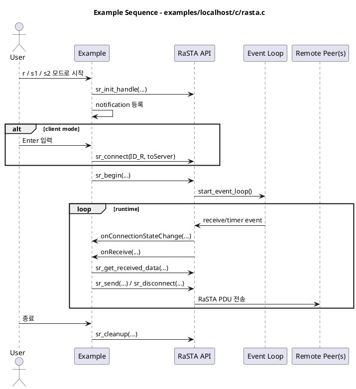

### `examples/rasta/c/main.c`

역할:
- 동일한 forwarding 시나리오를 보여주는 구형 networked RaSTA 데모입니다.

주요 함수:
- `printHelpAndExit`
- `addRastaString`
- `onConnectionStateChange`
- `onHandshakeCompleted`
- `onTimeout`
- `onReceive`
- `main`

비고:
- 최신 FD-event 통합 방식 대신 blocking `getchar` 흐름을 사용합니다.

시퀀스 다이어그램:

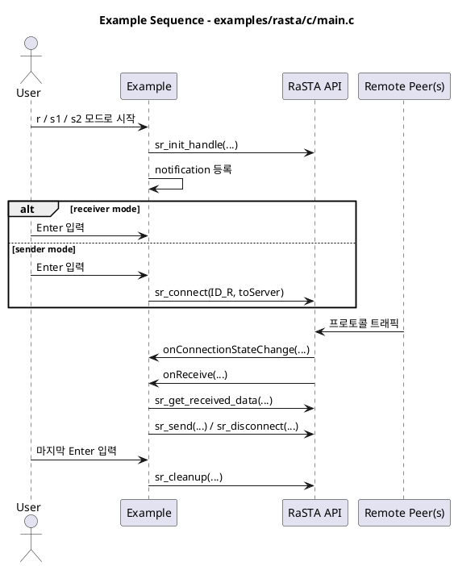

### `examples/localhost/c/scip.c` 와 `examples/scip/c/main.c`

역할:
- RaSTA 위에서 SCI-P를 사용하는 방법을 보여줍니다.

주요 함수:
- `printHelpAndExit`
- `onReceive`: RaSTA receive callback을 SCI-P receive 처리로 넘깁니다.
- `onHandshakeComplete`: remote SCI name을 등록하고 example telegram을 보냅니다.
- `onChangeLocation`: 들어온 point target location command를 처리합니다.
- `onLocationStatus`: 들어온 point status를 처리합니다.
- `main`: RaSTA와 SCI-P 객체를 초기화하고 예제를 구동합니다.

시퀀스 다이어그램:

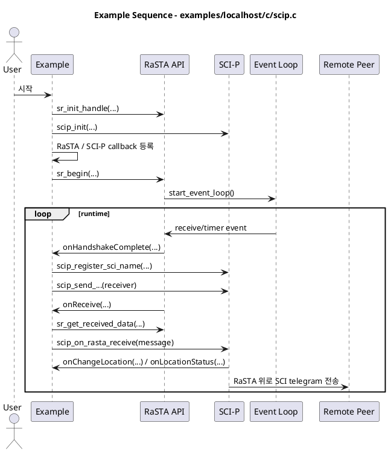

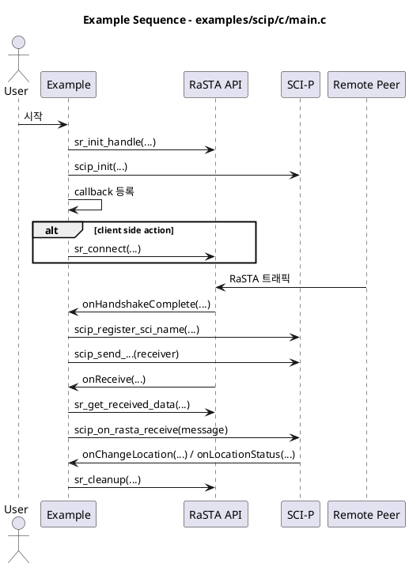

### `examples/localhost/c/scils.c` 와 `examples/scils/c/main.c`

역할:
- RaSTA 위에서 SCI-LS를 사용하는 방법을 보여줍니다.

주요 함수:
- `printHelpAndExit`
- `onReceive`
- `onHandshakeComplete`
- `onShowSignalAspect`
- `onSignalAspectStatus`
- `main`

시퀀스 다이어그램:

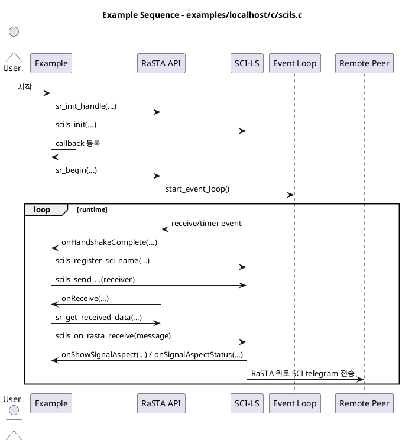

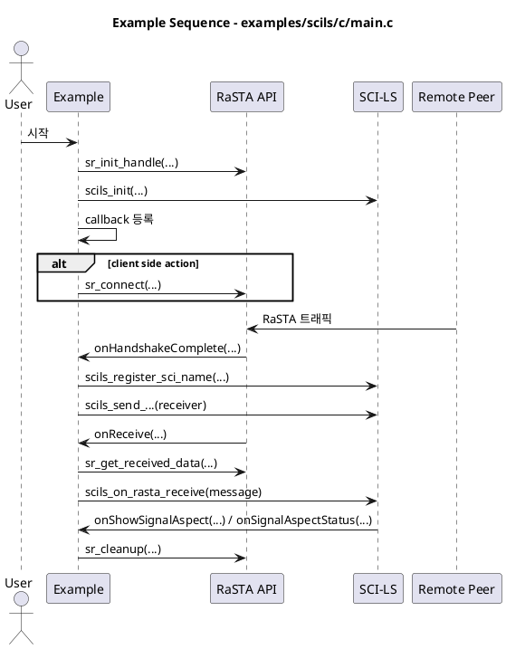

### `examples/localhost/c/event_test.c`

역할:
- event system만 따로 보여주는 작은 standalone 데모입니다.

주요 함수:
- `test_get_nanotime`
- `send_heartbeat_event`
- `disconnect_event`
- `event_read`
- `main`

시퀀스 다이어그램:

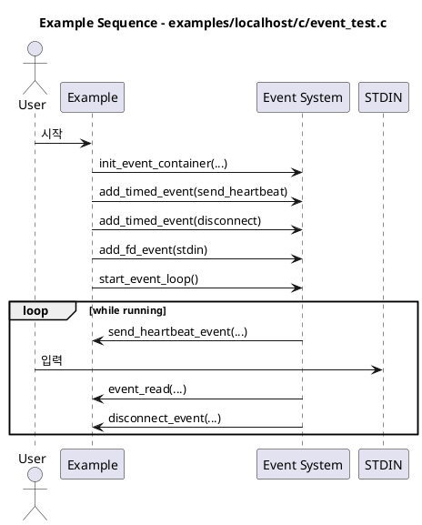

### `examples/redundancy_test/c/main.c`

역할:
- full RaSTA SR layer 없이 redundancy layer만 수동 점검하는 forwarding 테스트입니다.

주요 함수:
- `on_new_connection`: 새 redundancy channel 발견 시 처리합니다.
- `main`: 수동 redundancy 예제를 구성하고 실행합니다.

시퀀스 다이어그램:

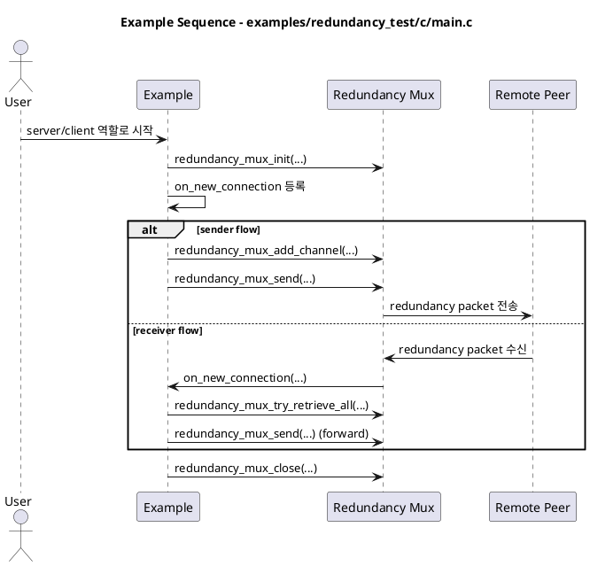

### `examples/mux_stresstest/c/main.c`

역할:
- redundancy multiplexer를 stress 스타일로 점검하는 프로그램입니다.

주요 함수:
- `on_new_connection`
- `main`

시퀀스 다이어그램:

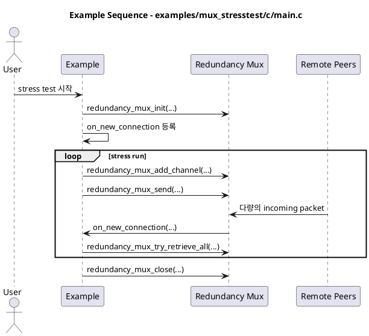

### `examples/logging/c/main.c`

역할:
- logger 사용 예제입니다.

주요 함수:
- `main`

시퀀스 다이어그램:

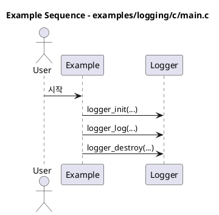

### `examples/tests_manual/c/raw_udp_test.c`

역할:
- socket 레벨 점검을 위한 수동 raw UDP helper입니다.

주요 함수:
- `printHelpAndExit`
- `main`

시퀀스 다이어그램:

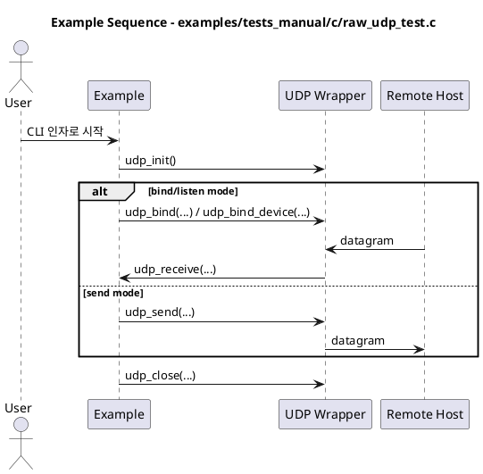

### `examples/wrapperTestClient/c/main.c`

역할:
- wrapper/native 연동 테스트용 client 예제입니다.

주요 함수:
- `addRastaString`
- `onConnectionStateChange`
- `onReceive`
- `main`

시퀀스 다이어그램:

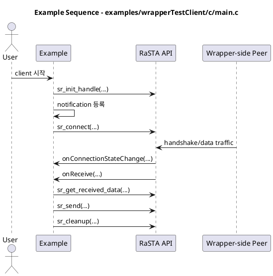

## 테스트 파일

### 테스트 구성

`tests` 디렉터리는 저수준 모듈을 위한 CUnit suite를 포함합니다.
자료구조와 직렬화 테스트는 비교적 잘 되어 있고, end-to-end 프로토콜
동작 검증은 상대적으로 얇은 편입니다.

### `tests/rasta/c/registerTests.c`

역할:
- 모든 RaSTA CUnit test suite를 등록하고 실행합니다.

주요 함수:
- `suite_init`
- `suite_clean`
- `cunit_register`
- `main`

### `tests/sci/c/registerTests.c`

역할:
- 모든 SCI CUnit test suite를 등록하고 실행합니다.

주요 함수:
- `suite_init`
- `suite_clean`
- `cunit_register`
- `main`

### RaSTA 단위 테스트

- `tests/rasta/c/configtest.c`
  - `check_std_config`: 기본 config 동작 검증
  - `check_var_config`: override된 config 값 검증
- `tests/rasta/c/dictionarytest.c`
  - `testDictionary`: dictionary 삽입/조회 테스트
- `tests/rasta/c/fifotest.c`
  - `test_push`, `test_pop`: FIFO 동작 검증
- `tests/rasta/c/rastacrcTest.c`
  - `test_opt_b`, `test_opt_c`, `test_opt_d`, `test_opt_e`,
    `test_without_gen_table`: CRC 옵션 검증
- `tests/rasta/c/rastadeferqueueTest.c`
  - `test_deferqueue_init`, `test_deferqueue_destroy`, `test_deferqueue_add`,
    `test_deferqueue_remove`, `test_deferqueue_add_full`,
    `test_deferqueue_remove_not_in_queue`, `test_deferqueue_contains`,
    `test_deferqueue_isfull`, `test_deferqueue_smallestseqnr`,
    `test_deferqueue_get`, `test_deferqueue_sorted`, `test_deferqueue_clear`,
    `test_deferqueue_get_ts`, `test_deferqueue_get_ts_doesnt_contain`
- `tests/rasta/c/rastafactoryTest.c`
  - `checkConnectionPacket`, `checkNormalPacket`,
    `checkDisconnectionRequest`, `checkMessagePacket`,
    `testCreateRedundancyPacket`, `testCreateRedundancyPacketNoChecksum`
- `tests/rasta/c/rastalisttest.c`
  - `check_rastalist`
- `tests/rasta/c/rastamd4Test.c`
  - `testMD4function`, `testRastaMD4Sample`
- `tests/rasta/c/rastamoduleTest.c`
  - `testConversion`,
    `testRedundancyConversionWithCrcChecksumCorrect`,
    `testRedundancyConversionWithoutChecksum`,
    `testRedundancyConversionIncorrectChecksum`
- `tests/rasta/c/blake2test.c`
  - `testBlake2Hash`, `selftest_seq`, `blake2b_selftest`
- `tests/rasta/c/siphash24test.c`
  - `testSipHash24`

### SCI 단위 테스트

- `tests/sci/c/sciTests.c`
  - `testEncode`, `testDecode`, `testDecodeInvalid`, `testSetSender`,
    `testSetReceiver`, `testGetName`, `testSetMessageType`,
    `testCreateVersionRequest`, `testCreateVersionResponse`,
    `testCreateStatusRequest`, `testCreateStatusBegin`,
    `testCreateStatusFinish`, `testGetMessageType`,
    `testParseVersionRequest`, `testParseVersionResponse`
- `tests/sci/c/scilsTests.c`
  - `testSignalAspectDefaults`, `testCreateShowSignalAspect`,
    `testCreateSignalAspectStatus`, `testCreateChangeBrightness`,
    `testCreateBrightnessStatus`, `testParseShowSignalAspect`,
    `testParseSignalAspectStatus`, `testParseChangeBrightness`,
    `testParseBrightnessStatus`
- `tests/sci/c/scipTests.c`
  - `testCreateChangeLocation`, `testCreateLocationStatus`,
    `testCreateTimeout`, `testParseChangeLocation`,
    `testParseLocationStatus`

## 먼저 읽을 만한 Public Header

구현을 보기 전에 API 표면을 먼저 이해하려면 아래 헤더가 가장 유용합니다.

- `src/rasta/headers/rasta_new.h`: 메인 public RaSTA API
- `src/rasta/headers/rastahandle.h`: handle 구조와 notification callback
- `src/rasta/headers/rastafactory.h`: packet payload 모델과 constructor
- `src/rasta/headers/rasta_red_multiplexer.h`: redundancy mux API와 데이터 모델
- `src/sci/headers/sci.h`: SCI telegram 모델
- `src/sci/headers/scip.h`: SCI-P API
- `src/sci/headers/scils.h`: SCI-LS API

## 권장 읽기 순서

새 엔지니어가 가장 빨리 이해하려면 다음 순서가 효율적입니다.

1. `src/rasta/headers/rasta_new.h`
2. `src/rasta/headers/rastahandle.h`
3. `src/rasta/c/rasta_new.c`
4. `src/rasta/c/rasta_red_multiplexer.c`
5. `src/rasta/c/rastamodule.c`
6. `src/rasta/c/rastafactory.c`
7. `src/rasta/c/config.c`
8. `src/sci/c/sci.c`
9. `src/sci/c/scip.c` 와 `src/sci/c/scils.c`
10. `examples/localhost/c/rasta.c`

## 코드 읽을 때 주의할 점

- 일부 주석은 thread 기반 동작을 설명하지만, 최신 런타임은 대부분
  event-loop 기반입니다.
- 예제는 구형 blocking 스타일과 신규 `sr_begin` 기반 event-driven 스타일이 섞여 있습니다.
- 저수준 crypto 파일은 고수준 프로토콜 동작을 이해하는 데는 우선순위가 낮습니다.
- 여러 모듈이 책임을 섞어 가지고 있어, 새로 구현한다면 더 분리하는 편이 좋습니다.
