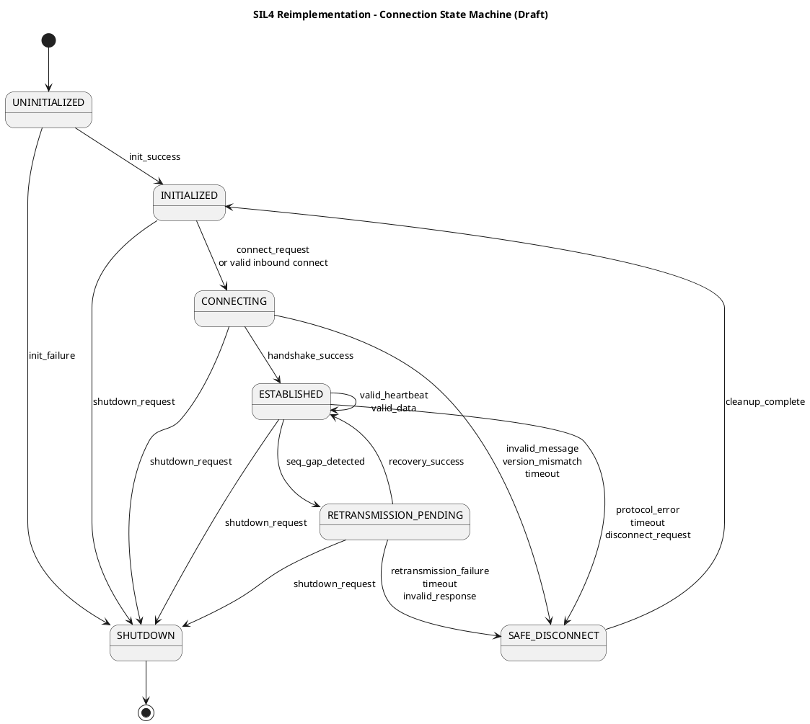

# High-Level Design Draft

## Document Control

- Document ID: `HLD-001`
- Version: `0.1.0`
- Status: `Draft`
- Owner: `Project Team`
- Reviewers: `TBD`
- Last Updated: `2026-03-13`

## Scope

- 설계 대상:
  - SIL4 대응용 재구현 통신 코어의 상위 구조
- 관련 요구사항:
  - `FR-001`
  - `FR-002`
  - `FR-003`
  - `FR-004`
  - `FR-005`
  - `FR-006`
  - `FR-007`
  - `SR-001`
  - `SR-002`
  - `SR-003`
  - `SR-004`
  - `IF-001`
  - `IF-002`

## Architectural Goals

- 안전 목표:
  - 허용되지 않은 메시지와 상태 전이를 fail-safe로 처리한다.
  - 타이머와 상태 머신 동작을 결정적으로 만든다.
  - 구현 전체를 요구사항과 테스트에 추적 가능하게 만든다.
- 성능 목표:
  - 명시된 타이밍 제약 내에서 연결 감독과 데이터 처리를 수행한다.
  - 불필요한 동적 할당 없이 bounded resource 정책을 사용한다.
- 유지보수 목표:
  - 프로토콜 로직, 플랫폼 추상화, 설정 검증, 진단을 모듈 단위로 분리한다.

## System Context

- 외부 시스템:
  - 상위 제어 애플리케이션
  - 원격 peer 노드
  - 운영체제/플랫폼 서비스
- 외부 인터페이스:
  - 공개 C API
  - transport abstraction interface
  - timer abstraction interface
  - diagnostic/logging interface
- 운영 환경:
  - Linux 유사 환경을 1차 기준으로 하되, 플랫폼 의존성은 abstraction 계층 아래로 격리한다.

## Module Breakdown

| Module ID | Module Name | Responsibility | Inputs | Outputs | Related Req IDs |
| --- | --- | --- | --- | --- | --- |
| MOD-001 | Public API Layer | 초기화, 연결, 송신, 수신, 종료 API를 제공하고 호출 순서를 통제한다 | API call | status, error, callbacks | FR-001, FR-005, IF-001 |
| MOD-002 | Connection State Machine | 연결 상태와 이벤트 처리 규칙을 관리한다 | decoded events, timer events | state transition, actions | FR-002, FR-004, SR-001, SR-002 |
| MOD-003 | Protocol Codec | packet/telegram 직렬화와 역직렬화를 담당한다 | typed data, raw bytes | raw bytes, typed data | FR-003, SR-001 |
| MOD-004 | Transport Supervisor | transport channel 송수신과 redundancy 정책을 관리한다 | send request, incoming frames | delivered frames, channel status | FR-003, FR-004, SR-002 |
| MOD-005 | Configuration Validator | 설정값 파싱, 타입/범위/일관성 검증을 담당한다 | config source | validated configuration | FR-006 |
| MOD-006 | Diagnostics and Logging | 진단 정보와 오류 기록을 구조적으로 생성한다 | events, state, errors | diagnostics, logs | FR-007, SR-004 |
| MOD-007 | Platform Abstraction | timer, socket, memory, synchronization 등 플랫폼 의존 기능을 격리한다 | module requests | platform services | IF-002, SR-003 |
| MOD-008 | Connection Orchestrator | 상태 머신 입력, action dispatch, 외부 adapter 경계를 조정한다 | api events, decoded events, timer events | action dispatch, transition report | FR-001, FR-005, IF-001, SR-004 |

## Data Flow

- 주요 입력 경로:
  - `Public API Layer`가 사용자 호출을 받아 `Connection State Machine` 또는 `Configuration Validator`로 전달
  - `Transport Supervisor`가 수신 frame을 받아 `Protocol Codec`과 `Connection State Machine`으로 전달
  - `Connection Orchestrator`가 외부 event를 받아 `Connection State Machine`에 주입하고 결과 action을 dispatch
- 주요 출력 경로:
  - 상태 전이 결과에 따라 `Transport Supervisor`가 frame 송신
  - `Diagnostics and Logging`가 구조적 이벤트 기록 생성
  - `Public API Layer`가 상위 계층 callback 또는 반환 코드 제공
- 오류 경로:
  - 설정 오류는 startup 단계에서 즉시 실패
  - 프로토콜 오류는 상태 머신을 통해 fail-safe 종료
  - 플랫폼 오류는 분류 후 복구 가능/불가능 경로로 나눔

## State Model

- 상태 요약:
  - `UNINITIALIZED`
  - `INITIALIZED`
  - `CONNECTING`
  - `ESTABLISHED`
  - `RETRANSMISSION_PENDING`
  - `SAFE_DISCONNECT`
  - `SHUTDOWN`
- 상태 전이 규칙:
  - 모든 전이는 명시적 이벤트에 의해 발생해야 한다.
  - 허용되지 않은 이벤트는 정의된 오류 처리 경로로만 진입한다.
  - timeout과 protocol violation은 `SAFE_DISCONNECT`로 이어져야 한다.
- 관련 다이어그램:
  - 아래 `Connection State Machine` 다이어그램 참조

### Connection State Machine

### Module Interface Focus: MOD-002 Connection State Machine

| Interface | Direction | Description |
| --- | --- | --- |
| `rsrx_state_machine_init` | In | 상태 머신 컨텍스트 초기화 |
| `rsrx_state_machine_handle_event` | In | 외부 이벤트를 받아 상태 전이와 action 결정 |
| `rsrx_state_machine_get_state` | Out | 현재 상태 조회 |
| `rsrx_state_machine_reset` | In | 종료 후 초기 상태로 복귀 |
| `state_machine_actions` | Out | 송신, 로그, 타이머 재설정, disconnect 등 후속 action 목록 |
| `transition_reason_code` | Out | 전이 또는 거부의 직접 원인 정보 |
| `diagnostic_code` | Out | 운영 로그 및 사후 분석용 진단 분류 정보 |

### Module Interface Focus: MOD-008 Connection Orchestrator

| Interface | Direction | Description |
| --- | --- | --- |
| `rsrx_orchestrator_init` | In | action sink와 상태 머신을 포함한 orchestrator 컨텍스트 초기화 |
| `rsrx_orchestrator_process_event` | In | 외부 event를 상태 머신에 전달하고 결과 action을 순서대로 dispatch |
| `rsrx_orchestrator_get_state` | Out | orchestration 관점 현재 연결 상태 조회 |
| `rsrx_orchestrator_reset` | In | orchestration 컨텍스트를 초기 상태로 복귀 |
| `transport/timer/api/diagnostics/lifecycle executors` | Out | 전이 결과의 action을 category별 executor에 순차 전달 |
| `transition_report` | Out | 상태 전이 결과와 dispatch 개수를 상위 계층에 제공 |

## Safety Mechanisms

- 오류 감지:
  - 메시지 타입, 길이, sequence, confirmation, timeout, 설정 유효성 검증
- fail-safe 동작:
  - 오류 유형에 따른 연결 종료 또는 시스템 시작 거부
- 타이머/감시:
  - monotonic clock 기반 감독
  - timeout 상한 및 재전송 window를 요구사항으로 고정
- 진단 정보:
  - 상태 변화, 오류 원인, 관련 peer, 관련 timer 값을 기록
  - 상태 머신은 전이 결과에 `reason code`와 `diagnostic code`를 함께 제공한다.

## Design Decisions

| Decision ID | Decision | Reason | Alternatives Considered | Impact |
| --- | --- | --- | --- | --- |
| DD-001 | 프로토타입과 별도 `sil4/` 작업공간을 사용한다 | 인증 대상 베이스라인 분리 | 기존 트리 직접 수정 | 추적성과 형상관리 개선 |
| DD-002 | 플랫폼 의존 기능을 별도 abstraction 계층으로 분리한다 | 검증성 및 이식성 향상 | 상위 로직 직접 OS 호출 | 테스트 구조 단순화 |
| DD-003 | 상태 머신을 독립 모듈로 분리한다 | 상태 전이 검증 용이 | 송수신 로직 내부에 분산 구현 | 리뷰성과 테스트성 향상 |
| DD-004 | 설정 검증을 startup 게이트로 둔다 | 위험한 설정으로 시작 금지 | 런타임 중 부분 보정 | 예측 가능성 향상 |
| DD-005 | 상태 결정과 side effect 실행 사이에 orchestrator 경계를 둔다 | pure state machine 유지와 인터페이스 검증성 확보 | state machine 내부에서 직접 side effect 실행 | 추적성과 단위 테스트성 향상 |

## Verification Impact

- 필요한 단위 테스트:
  - 상태 전이 단위 테스트
  - codec known-answer 테스트
  - config validation 테스트
- 필요한 통합 테스트:
  - handshake, timeout, retransmission, disconnect 시나리오
  - transport abstraction 대체 구현 기반 테스트
- 필요한 분석:
  - 정적분석
  - traceability review
  - timing analysis

## Open Issues

- OI-001: redundancy 정책을 하나의 모듈로 둘지, channel manager와 sequencing manager로 더 분리할지 결정 필요
- OI-002: public API를 synchronous API + callback 혼합으로 유지할지, event queue 기반으로 재설계할지 결정 필요
- OI-003: SCI 계층을 1차 범위에 포함할지, 하부 RaSTA 코어 안정화 후 2단계로 둘지 결정 필요
- OI-004: `SAFE_DISCONNECT` 이후 자동 복귀를 허용할지, 상위에서 명시적으로 재초기화할지 정책 결정 필요
